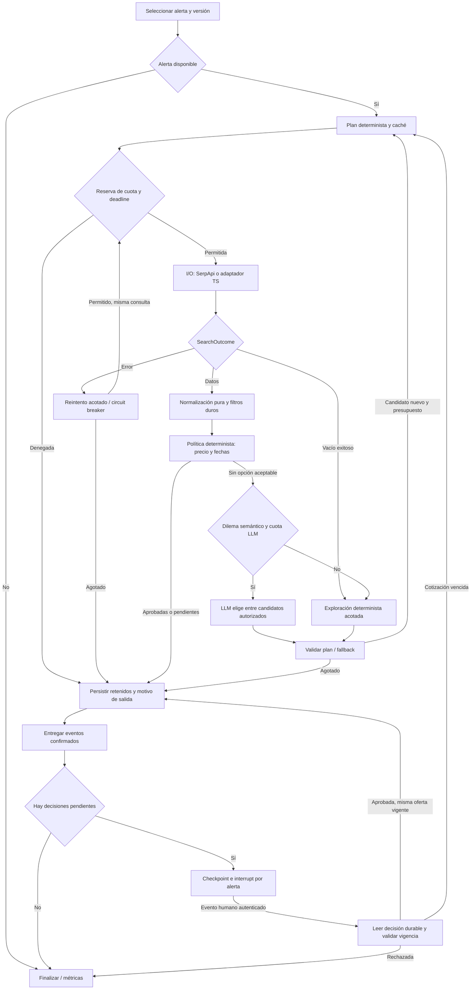

# Fly Hunter — propuesta de arquitectura y orquestación

Estado: propuesta; la suite de evals adjunta está implementada. No se modifican
el grafo, el Crítico ni el esquema de producción en esta entrega.

## 1. Especificación y arquitectura

### Alcance y diagnóstico verificable

Únicas fuentes del repositorio inspeccionadas: `agents.md`, `backend/src/graph.py`,
`backend/src/agents/critic.py` y `schema.sql`. El contrato TypeScript descrito aquí
es propuesto: su implementación no fue inspeccionada. Tampoco se verificaron los
internos de recolectores, persistencia o notificaciones importados por el grafo.

El Crítico ya separa filtros duros de planificación semántica, usa Pydantic 2,
limita refinamientos a dos y valida candidatos de calendario. El grafo retiene
ofertas anteriores y evita repetir pares de fechas durante una alerta.

Brechas observables:

- `GraphState` contiene diccionarios/listas mutables y los nodos modifican el
  estado recibido; `pick_alert_node` consume la misma lista mediante `pop(0)`.
- Un máximo de dos refinamientos permite tres recolecciones por alerta, pero no
  contabiliza solicitudes internas, reintentos ni consumo agregado entre alertas.
- Un resultado vacío o sin vuelos elegibles termina el Crítico. No existe un
  resultado tipado que distinga ausencia de inventario, datos inválidos y error.
- `pick_alert` siempre lleva a `supervisor`, incluso sin alerta seleccionada.
- Un delta inválido lanza `ValueError` y puede abortar antes de persistir lo retenido.
- `persistence_and_notify_node` omite ofertas que no validan como `FlightDeal`,
  pero luego recorre la lista original para notificar. No usa una confirmación de
  persistencia ni consulta el estado durable de notificación en ese punto.
- La prioridad de notificación es tarifa error, oro y luego anomalía: una oferta
  pendiente puede recibir un aviso de oro en lugar de uno que solicite aprobación.
- `build_graph()` compila sin checkpointer; no hay nodo de aprobación/reanudación.
- `schema.sql` no modela ejecuciones, relación oferta-alerta, cuota ni eventos de
  entrega; `hash_dedupe` permite NULL y omite pasajeros, redondeando además el precio.
- `_cost` extrapola cotizaciones a otra cantidad de pasajeros. Esa estimación
  puede servir para explorar, pero no demuestra disponibilidad a ese precio.
- Oro/tarifa error fuera de ventana queda pendiente aun a más de un día: la rama
  de oro no aplica `ANOMALY_DATE_MARGIN`. Hay que fijar explícitamente esa política.

### Responsabilidades y contratos

Python es el único dueño de decisiones, presupuesto, persistencia y avisos.
SerpApi y TypeScript/Playwright son adaptadores de adquisición intercambiables.
TypeScript entrega observaciones; no aprueba ofertas ni realiza arbitraje basado
en texto generado. Una cotización comprobada debe vincularse a fuente, consulta,
pasajeros, moneda, instante y evidencia.

Usar modelos Pydantic con `frozen=True`, `extra="forbid"` y validación estricta.
La inmutabilidad exige modelos anidados congelados y tuplas: congelar un modelo
con un campo `dict` o `list` no hace inmutable ese contenido. En la frontera JSON,
validar fechas/enums explícitamente y convertir arrays a tuplas; no reutilizar
referencias mutables del payload. Publicar el JSON Schema versionado para ambos
motores. Cada nodo devuelve un parche nuevo del estado de LangGraph.

| Contrato | Campos mínimos / invariantes |
|---|---|
| `SearchSpec` | schema_version, alert_id, alert_version, origen, destino, fechas, adultos, cabina, moneda; ida < vuelta, fechas autorizadas, adultos >= 1 |
| `SearchOutcome` | query_key, provider, status (`ok`, `empty`, `transient_error`, `permanent_error`, `invalid_data`), tuple de observaciones, fetched_at, intentos, latencia, cache_hit |
| `FlightQuote` | quote_id, fuente, query_key, rutas, fechas, pasajeros realmente cotizados, total en centavos USD, moneda/importe original, aerolíneas por tramo, escalas por sentido, observed_at, evidence_ref |
| `PolicyDecision` | alert_id/version, quote_id, estado, reason_codes, flags oro/error, policy_version; no autoriza compras |
| `RefinementPlan` | search_key padre, próximo SearchSpec permitido o stop_reason, justificación breve, evidencia e incertidumbre, origin (`llm`, `heuristic`) |
| `RunBudget` | límite y reserva de solicitudes por proveedor, tokens/coste máximo, deadline, refinamientos usados; ninguna reserva puede dejar saldo negativo |
| `PersistReceipt` | identificadores efectivamente guardados y decisiones/eventos confirmados; única entrada de la fase de avisos |

El estado agrega identificadores, estos contratos y tuplas de búsquedas visitadas
y ofertas retenidas. Las claves se calculan con serialización canónica y SHA-256:
`query_key` incluye todos los parámetros que alteran la cotización, proveedor y
versión de contrato. La frescura se valida por timestamp, no cambiando la clave.
No reemplazar el hash histórico sin una migración compatible de identidades.

### Máquina de estados propuesta



La flecha LLM termina en un plan de consulta, nunca en aprobación ni escritura.
Las reglas duras rechazan precio desconocido/inconsistente, cotización sin
identidad suficiente, aerolínea excluida y más de una escala por sentido, incluso
para oro. Comparar presupuesto solo con cotización para los pasajeros exactos.
Oro dentro de ventana puede saltar el presupuesto mínimo; una anomalía autorizable
requiere aprobación humana. Propuesta explícita: limitar anomalías temporales a
un día; una tarifa oro más distante se registra como hallazgo fuera de alcance,
sin aprobarla ni bloquear la alerta. Esta última regla cambia el comportamiento
actual y debe quedar versionada al implementarla.

El calendario produce alternativas dentro de ventanas, conserva razonablemente
la duración y evita consultas previas. Evitar domingo es una prioridad de
exploración, no evidencia de ahorro. Sin horarios no puede concluirse “domingo a
la noche”; sin calendario geográfico verificado no se infieren feriados.

### Autonomía y circuit breakers

- Máximo: búsqueda inicial + dos refinamientos por alerta; contar el consumo por
  separado. Un reintento repite la misma consulta y NO cuenta como refinamiento,
  pero SÍ consume una reserva de solicitud. Los SDK no deben ocultar reintentos:
  instrumentarlos o desactivarlos y centralizar la política en el adaptador.
- Cuota global durable por proveedor y período, compartida por ambos motores y
  todos los jobs. Reservar atómicamente antes de cada intento; ante timeout con
  resultado incierto, conservar el débito hasta reconciliación. Un acierto de
  caché válida no consume cuota externa. Consultar caché también al refinar.
- El límite de 250/mes aparece como comentario, no como una garantía comprobada.
  Si fuera la cuota real, cuatro runs diarios durante 31 días son 124 runs:
  unas dos solicitudes por run antes de reintentos. Asignar primero búsquedas
  iniciales en round-robin durable y dar refinamientos solo del saldo sobrante.
  No reiniciar siempre por la primera alerta ni gastar toda la cuota en ella.
- Valores iniciales propuestos: concurrencia externa 1, máximo tres intentos
  SerpApi por consulta, dos intentos LLM por decisión, timeout LLM 15 s,
  timeout por adquisición 60 s y deadline por alerta 180 s. Cada límite queda
  subordinado al saldo global; calibrar con latencias reales. El driver del run
  deja margen para persistir antes del timeout del job.
- Para 429/5xx/timeout: backoff exponencial, respetar Retry-After sin superar el
  deadline. Un 403 se clasifica por señal del proveedor: fallo de credencial es
  permanente; uno transitorio identificado admite retry acotado. Ningún error se
  convierte en cotización vacía ni en precio inventado.
- Breaker persistido por proveedor: CLOSED -> OPEN tras tres fallos transitorios
  consecutivos; enfriamiento inicial 15 minutos; HALF_OPEN admite un único intento
  reservado. Éxito cierra; fallo vuelve a abrir. Fallos de configuración bloquean
  ese proveedor hasta corrección; otro adaptador puede usarse si tiene cuota.
- Tokens: acotar contexto, máximo dos decisiones LLM por alerta y salida <= 2048
  tokens; reservar también entrada y razonamiento según el modelo configurado.
  Registrar usage real; si falta, `null` más reserva conservadora, nunca cero.
  Agotado el LLM, continuar por heurística si queda presupuesto de búsqueda.
- Vacío exitoso: permitir una alternativa determinista si queda cuota. Si todos
  los resultados fueron descartados por reglas duras, explorar como máximo una
  alternativa autorizada sin exponerlos al LLM. Datos corruptos y errores de
  proveedor siguen la ruta de fallo, no una búsqueda semántica.
- Si hay un dilema cercano al presupuesto, candidatos inéditos y saldo para una
  búsqueda mínima, una negativa del LLM no debe ser el único motivo de parada:
  habilitar esa exploración determinista mínima. El modelo puede ordenar fechas;
  las reglas controlan el gasto y las condiciones de terminación.
- Toda salida tiene código: APPROVED_FOUND, HUMAN_REVIEW, NO_CANDIDATES,
  QUOTA_EXHAUSTED, DEADLINE, PROVIDER_UNAVAILABLE, INVALID_PLAN, POLICY_REJECTED.
  Agotar cuota difiere la alerta al próximo run; no desactiva el radar.

### Aprobación humana y reanudación idempotente

Mantener GitHub Actions como ejecutor efímero. Cada alerta usa un `thread_id`
durable por ejecución y versión; un driver procesa otras alertas aunque una esté
interrumpida. Un Postgres checkpointer conserva el estado fuera del runner. No
dejar un proceso de Actions esperando el click humano.

1. Guardar oferta, decisión `pendiente` y evento de revisión en una transacción.
   La decisión vincula quote_id, alert_id/version, precio, restricciones aprobables
   y vencimiento. El aviso de oro pendiente es una revisión de alta prioridad.
2. Un nodo dedicado ejecuta `interrupt` tras esa persistencia. El endpoint con
   ADMIN_TOKEN y autorización sobre la decisión hace compare-and-set desde
   `pendiente` a `aprobado`/`rechazado` e inserta un evento de reanudación único.
3. Despachar `repository_dispatch: resume-after-approval` desde ese evento.
   Si falla el envío, el próximo run drena el evento pendiente. Aceptar entrega
   duplicada del webhook: GitHub transporta el identificador, no la autoridad.
4. El job reclama mediante lease el evento/hilo y relee la decisión en Supabase.
   Ejecuta `Command(resume=...)` con el mismo thread_id solo si sigue esperando;
   un hilo ya completado produce un no-op. El valor de resume identifica el evento;
   el nodo valida su estado durable y no confía en un booleano del payload.
5. Si cambió la alerta, venció la oferta o cambió precio/ruta/pasajeros tras una
   revalidación, la aprobación no se transfiere a la nueva oferta. Crear otra
   decisión cuando corresponda. La revalidación consume cuota explícita.
6. Rechazar finaliza esa decisión; aprobar habilita su procesamiento posterior.
   No compra pasajes. Una reanudación no vuelve a ejecutar el estratega ni repite
   una recolección vigente. Los efectos antes de un interrupt deben ser idempotentes
   porque LangGraph reejecuta el nodo interrumpido al reanudar.

Migraciones propuestas, separadas del SQL actual:

- `agent_runs`: run_id, thread_id único, alert_id/version, status, deadline,
  policy/prompt/model_version, lease y métricas; checkpointer en sus tablas propias.
- `deal_decisions`: decisión por oferta y alerta/version, revision, status,
  expires_at, approved_at, resumed_at; UNIQUE(quote_id, alert_id, alert_version).
- `agent_outbox`: event_id, tipo (review, golden, resume), decision_id/revision,
  destino, status, intentos, lease_until, provider_message_id;
  UNIQUE(decision_id, revision, tipo, destino).
- `provider_usage`: reservas e intentos durables por proveedor/período, claves
  únicas de intento y estado de breaker. Aplicar reservas dentro de transacciones
  con bloqueo de fila para evitar saldo negativo bajo concurrencia.
- En ofertas: identidad exacta de cotización, pasajeros/cabina y observación;
  precios positivos, escalas válidas, estado limitado y dedupe obligatorio después
  de limpiar datos históricos. Unicidad de oferta y unicidad de decisión son distintas.

Todas las tablas operativas son privadas al backend mediante RLS. Una oferta
compartida no implica que su decisión o notificación sean globales entre usuarios.

La outbox desacopla escritura y entrega. El consumidor usa el event_id como clave
de idempotencia si el proveedor la admite y persiste el recibo inmediatamente.
Un booleano `notificado` no resuelve el crash entre envío y marcado. Sin soporte
de idempotencia/reconciliación del proveedor, hay entrega al menos una vez y un
riesgo residual de duplicado; no prometer exactly-once para email.

Referencias técnicas: [interrupts de LangGraph](https://docs.langchain.com/oss/python/langgraph/interrupts),
[persistencia](https://docs.langchain.com/oss/python/langgraph/persistence).

## 2. Suite de evals implementada

Archivo completo: `evals/test_critic_decisions.py`. Usa unittest, Pydantic 2 y
carga directamente critic.py para evitar efectos de inicialización del backend.
Reloj fijo: 2027-01-01; calendario de viaje: abril/mayo de 2027. Gemini está
sustituido por dobles controlados; ninguna clave o conexión externa es necesaria.

```sh
python -B evals/test_critic_decisions.py
python -B evals/test_critic_decisions.py --strict
```

Resultados locales: 18 tests, 17 aprobados y un fallo esperado documentado
(vacío exitoso no explora). El modo normal detecta regresiones; `--strict` devuelve
exit 1 mientras exista esa brecha. Una mejora que haga pasar el test pendiente
produce unexpected success: quitar el decorador tras revisar el cambio. No
presentar una suite con fallos esperados como cumplimiento total de la propuesta.

Casos centrales: tarifa error de USD 600 para dos; misma tarifa con dos escalas;
USD 2600 frente a máximo 2400 y alternativas de calendario; salida un día fuera
de ventana a USD 2000. También cubre límites exactos, aerolínea excluida mezclada,
precios inválidos, calendario visitado, dos refinamientos, fechas fijas, ausencia
de LLM en reglas duras, preservación de entradas y respuestas inválidas del SDK.

El test de proveedor valida que JSON malformado, salida truncada, acción no
autorizada y timeout devuelven señal de fallback. No garantiza que un proveedor
nunca produzca JSON inválido; comprueba que esa salida no se acepta como decisión.

### Evals del razonamiento real

Estos tests verifican contratos y decisiones programáticas, no la calidad del
modelo vivo. Tras cambios de prompt/modelo, ejecutar aparte un conjunto versionado
de contextos sintéticos con salida capturada, bajo un presupuesto explícito.
Mantener offline la validación obligatoria de cada PR. El smoke test de proveedor
es manual o de cadencia baja, sin SerpApi, con tokens registrados.

Puertas programáticas: 100% de acciones dentro de candidatos, cero aprobaciones
decididas por LLM, cero vuelos prohibidos en contexto, cero violaciones de ventanas
o cuota y fallback ante salida inválida. No exigir una fecha única cuando varias
son válidas: evaluar restricciones y decisiones útiles, no coincidencia textual.

Judge opcional: recibe contexto saneado y respuesta, con rúbrica 0–2 por fidelidad
a cotizaciones, explicación del cambio y reconocimiento de incertidumbre. Umbral
inicial propuesto >= 5/6 y cero afirmaciones de ahorro/feriados sin respaldo. Fijar
versión del judge, comparar A/B a ciegas y repetir tres veces por contexto para
medir variación. Calibrar primero con un pequeño conjunto anotado por humano.
El judge no sustituye reglas duras ni habilita producción por sí solo; no evaluar
cadena de pensamiento oculta, sino justificación y hechos observables.

Agregar pruebas de integración al implementar las migraciones: doble aprobación,
webhook duplicado, caída tras persistir/tras enviar, aprobación vencida, dos workers
reservando el último crédito y cero alertas. No están cubiertas por la suite actual.

## 3. Mejoras de orquestación y observabilidad

Implementar en este orden, manteniendo un solo orquestador:

1. **Rutas y resultados:** entrada tipada, nodo puro de normalización/política,
   salida explícita sin alertas, SearchOutcome que separe fallos de vacío, parada
   controlada ante plan inválido y persistencia de retenidos. Devolver parches del
   estado. Si sigue el loop multi-alerta actual, derivar recursion_limit de su
   tamaño y pasos máximos; ese límite es defensa final, no contador de cuota.
2. **Cuota en la frontera I/O:** presupuesto compartido, caché por consulta,
   contador de intentos y circuit breaker. No envolver a ciegas un recolector que
   podría reintentar internamente: primero instrumentar su frontera HTTP real.
3. **Persistencia/avisos:** separar nodos y consumir PersistReceipt/outbox; enviar
   solo sobre filas confirmadas. Pendiente tiene prioridad semántica sobre oro,
   aunque conserve su urgencia. Estadísticas al final no deben impedir persistir
   ofertas ni completar decisiones; su fallo se registra por separado.
4. **HITL durable:** tablas y checkpointer, driver por alerta, nodo de interrupt,
   endpoint CAS y consumidor de resume. Probar duplicados y fallos antes de activar.
5. **Entorno reproducible:** fijar Python/Node y dependencias en manifests/locks,
   validar secrets al arranque, versionar esquema/política/prompt/modelo, modo
   offline por defecto en CI y smoke test de proveedor separado. Estos archivos
   quedan fuera del alcance inspeccionado y no se modificaron. GitHub Actions
   continúa como runtime; no hacen falta servidores permanentes ni otro framework.

### Logging estructurado

Emitir JSON Lines por inicio/fin/fallo de nodo, solicitud y decisión. Usar UTC
para correlación y reloj monotónico para elapsed_ms. Identificadores opacos de
run, alerta y consulta; nunca emails, tokens de acceso, cookies, payloads completos
ni URLs que contengan credenciales. Reason codes permiten estadísticas sin
depender de texto libre. Registrar descartes antes de perderlos en el filtrado.

Ejemplo sintético:

```json
{
  "schema_version": 1,
  "ts": "2026-09-11T12:00:00Z",
  "event": "critic.completed",
  "run_id": "run-example",
  "thread_id": "alert-example:v3:run-example",
  "alert_id": "alert-example",
  "query_key": "sha256-example",
  "node": "critic",
  "iteration": 1,
  "provider": "gemini",
  "attempt": 1,
  "elapsed_ms": 842,
  "tokens_input": 690,
  "tokens_output": 140,
  "tokens_reasoning": null,
  "usage_source": "provider",
  "decision": "refine",
  "decision_origin": "llm",
  "reason_code": "OVER_BUDGET_CALENDAR_ALTERNATIVE",
  "discard_counts": {"TOO_MANY_STOPS": 2, "EXCLUDED_AIRLINE": 1},
  "remaining_search_requests": 2,
  "cache_hit": false,
  "breaker_state": "closed",
  "policy_version": "critic-policy-v1",
  "prompt_version": "calendar-v1",
  "model": "configured-model-id"
}
```

La respuesta de Gemini dispone de metadatos de uso; conservarlos en el adaptador
en vez de descartarlos al devolver solo `RefinementDecision`. Guardar como null
lo no disponible. Referencia: [Google Gen AI SDK](https://googleapis.github.io/python-genai/).

Métricas mínimas: solicitudes reales/run, cache hit ratio, latencia p50/p95,
fallbacks/llamadas LLM, refinamientos con mejora comprobada, porcentaje de salidas
por cuota/error, descartes por causa y tiempo hasta revisión humana. Calcular
éxito de refinamiento solo comparando cotizaciones verificadas para el mismo
grupo; emitir logs consultables primero, sin incorporar una plataforma adicional.
