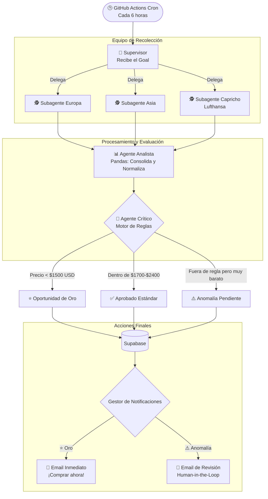

# ✈️ Flight Hunter

Un sistema proactivo de rastreo y alerta de vuelos construido con una arquitectura de **Agentes Inteligentes (LangGraph)**. Diseñado para encontrar, evaluar y notificar pasajes económicos hacia Europa y Asia de forma completamente autónoma.

## 🧠 Arquitectura de Agentes Inteligentes

El corazón de Flight Hunter es un grafo de agentes (construido con **LangGraph** en Python) que simula el trabajo de un equipo de analistas de viajes. En lugar de una simple búsqueda lineal, los agentes colaboran, delegan tareas en paralelo y toman decisiones basadas en reglas de negocio estrictas.

### ¿Cómo funciona el Grafo?

### Roles de los Agentes

1. **Supervisor:** Recibe el objetivo principal (fechas, presupuesto, destinos) y orquesta la ejecución en paralelo de los recolectores.
2. **Subagentes Recolectores (Europa, Asia, Capricho):** Especialistas en buscar rutas específicas usando la librería `fli` (reverse-engineering de la API de vuelos, lo cual evita costos y uso de tokens limitados).
3. **Agente Analista:** Utiliza `pandas` para consolidar los JSON dispares devueltos por los recolectores, calcular los precios finales para 2 pasajeros y normalizar la estructura de datos.
4. **Agente Crítico:** El "cerebro" de decisiones. Evalúa las ofertas contra las reglas de negocio:
   - **Oportunidad de Oro:** Si es obscenamente barato (ej. <$1500 USD), aprueba y fuerza una notificación urgente.
   - **Aprobado:** Pasa directo a la base de datos si cumple fechas y presupuesto estándar.
   - **Anomalía (Human-in-the-Loop):** Detecta vuelos baratos que rompen levemente las reglas (ej. salida 1 día antes o más escalas de las deseadas). En lugar de descartarlos, solicita revisión humana para que el usuario decida vía Frontend.

---

## 🛠️ Stack Tecnológico

El sistema fue diseñado priorizando la eficiencia, los bajos costos (*serverless*) y la simplicidad operativa.

- **Orquestación (Backend):** Python + LangGraph + Pandas.
- **Motor de Ejecución:** GitHub Actions. Ejecuta el pipeline cada 6 horas vía *cron*. Esto evita mantener servidores prendidos 24/7 y permite ejecuciones de larga duración.
- **Base de Datos:** Supabase (PostgreSQL). Implementa `hash_dedupe` para evitar re-insertar la misma oferta y reglas de seguridad RLS.
- **Frontend & API:** Astro desplegado en Vercel. Presenta un dashboard (Bento Grid) para ver vuelos y expone un endpoint `/api/aprobar-anomalia` para reanudar el grafo tras una aprobación humana.
- **Notificaciones:** Resend para emails transaccionales.

## 📂 Estructura del Repositorio

- `/backend`: Lógica de agentes en Python. Punto de entrada principal para GitHub Actions: `main.py`.
- `/frontend`: Dashboard web en Astro.
- `.github/workflows`: Definición del pipeline periódico y los receptores de *webhooks* (dispatches).
- `schema.sql`: Script DDL para replicar la estructura de la base de datos en Supabase.
- `agents.md`: Instrucciones fundamentales de arquitectura para desarrollo asistido por IA.

## 🚀 Configuración y Despliegue

1. **Base de Datos:** Ejecuta `schema.sql` en el SQL Editor de tu proyecto en Supabase.
2. **Backend (GitHub Actions):** 
   - Carga los secretos en el repositorio: `SUPABASE_URL`, `SUPABASE_SERVICE_ROLE_KEY`, `RESEND_API_KEY`, `ALERT_EMAIL_TO`, `GH_DISPATCH_TOKEN`.
3. **Frontend (Vercel):** 
   - Vincula el directorio `/frontend` a un proyecto en Vercel.
   - Configura las variables de entorno: `SUPABASE_URL`, `SUPABASE_ANON_KEY`, `SUPABASE_SERVICE_ROLE_KEY`, `GH_DISPATCH_TOKEN`, `GH_REPO`.