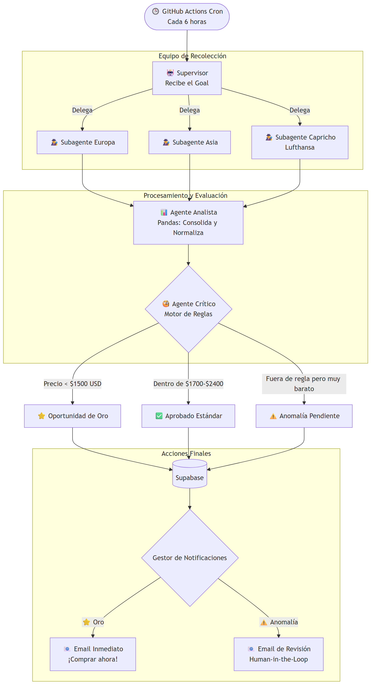

# 🛫 Fly Hunter

Un sistema autónomo y proactivo de rastreo, evaluación y alerta de pasajes aéreos globales, construido sobre una arquitectura de **Doble Motor: Playwright Stealth + LangGraph State Machine con Razonamiento LLM (Gemini Flash)**.

---

## 🎯 ¿Qué es Fly Hunter?

Fly Hunter automatiza la búsqueda de vuelos baratos (ej: Buenos Aires hacia Madrid, Barcelona, Miami o Tokio) para múltiples alertas de viaje configuradas en tiempo real. 

A diferencia de los buscadores comerciales tradicionales, cuenta con un **Doble Motor Híbrido**:
1. **Motor de Scalpeo Directo a Costo $0 (TypeScript / Playwright)**: Navega de forma autónoma con emulación de navegador real y plugins stealth para consultar Google Flights y Despegar sin consumir cuota de API.
2. **Motor de Inteligencia de Grafos Cíclicos (Python / LangGraph)**: Ejecuta una máquina de estados cíclica con razonamiento de IA para evaluar presupuestos, ejecutar **loops de auto-corrección** (refinando fechas si una tarifa excede el presupuesto), y proteger la cuota de **SerpApi (250 búsquedas/mes, renueva los días 23)**.

---

## 🏗 Arquitectura del Sistema (Dual-Engine)

<p align="center">
  
</p>

---

## 🧠 Ciclos y Loops de la Ingeniería de Grafos (LangGraph)

1. **Loop de Refinamiento y Auto-Corrección (Self-Correction Loop):**
   - Si los vuelos encontrados superan el presupuesto por un margen estrecho o no hay opciones con pocas escalas, el Agente Crítico razona: *"Tarifa supera presupuesto por $120 USD. Mover salida 1 día antes suele abaratar la tarifa 25%"*.
   - El grafo se auto-corrige mediante una arista condicional hacia `refine_search_node`, adaptando las fechas y consultando nuevamente.
   - **Guardia de Seguridad:** Limitado a un máximo de 2 iteraciones (`max_iterations = 2`) para no quemar cuota ni tokens.
2. **Loop Multi-Alerta (Multi-Alert Iterator):**
   - El grafo no se detiene en la primera alerta; encola todas las alertas activas en Supabase (`alerts_queue`) y las procesa sucesivamente antes de pasar al nodo de Data Scientist.
3. **Escudo Híbrido de Cuota:**
   - **Playwright** scalpea directo a costo $0.
   - **Supabase** guarda estos hallazgos frescos.
   - **Python LangGraph** reutiliza primero los datos de Playwright a costo $0.
   - **SerpApi (250 búsquedas/mes, renueva el 23)** actúa como red de seguridad infalible en caso de fallo o refinamiento.

---

## 🛡️ Control de Cuotas y Rate Limits

| Servicio | Límite de Cuenta | Estrategia de Consumo & Auditoría Automática |
| :--- | :--- | :--- |
| **SerpApi** | **250 búsquedas / mes** (renueva el **23 de cada mes**). | **Auditoría sin costo (`/account.json`):** El sistema consulta el balance de cuenta oficial (gratuito) antes de cada búsqueda. Si restan $\le 2$ créditos, **bloquea SerpApi hasta el 23 de septiembre** y opera 100% a costo $0 con Playwright. Al renovarse el cupo, desbloquea y contabiliza las 250 búsquedas en cada corrida. |
| **Gemini AI Studio** | **20 RPD** (Requests por día), **5 RPM** (Free Tier). | **Batching obligatorio:** Se envían los vuelos en lote por alerta (1 call). Consumo real: 4 a 8 calls/día. Anti-crash a reglas heurísticas en caso de HTTP 429. |
| **Antigravity** | **100 RPD**, **60 RPM**. | Entorno de agentes de alta frecuencia. |

### 🔒 Comportamiento del Auditor de Cuota de SerpApi:
* **Hasta el 23 de Septiembre:** Dado que la cuota actual está consumida, el guardián detecta automáticamente el estado y bloquea cualquier llamada a SerpApi, delegando el 100% de la recolección en Playwright (Google Flights y Despegar) a **costo $0**.
* **A partir del 23 de Septiembre:** Al restablecerse las **250 búsquedas mensuales**, el endpoint `/account.json` reportará `total_searches_left = 250`. El sistema detectará la renovación de inmediato y activará el muestreo híbrido y fallback inteligente de manera gradual y controlada.

---

## 🛠 Stack Tecnológico

* **Automatización Web Headless:** `Playwright Extra` + `Puppeteer Stealth Plugin` + `Node.js / TypeScript`.
* **Motor de IA y Razonamiento:** `Google Gemini API` (`gemini-3.6-flash`, `gemini-2.5-flash`, `gemini-2.0-flash`, `gemini-1.5-flash`).
* **Ingeniería de Grafos (Backend):** `Python 3.11` + `LangGraph` + `LangChain` + `Pandas` + `Pydantic`.
* **Ciencia de Datos y Tendencias:** Regresión lineal (`numpy.polyfit`), medias móviles de 7 días, y detección automática de feriados (`holidays`).
* **Base de Datos & Auth:** `Supabase (PostgreSQL)` con Row Level Security (RLS) y campos deduplicados mediante hash MD5 (`hash_dedupe`).
* **Frontend Radar:** `Astro` + `TypeScript` + `Tailwind / Glassmorphism`, con despliegue en `Vercel`.
* **Notificaciones:** `Resend` para correos transaccionales y alertas inmediatas.
* **Orquestación Serverless:** `GitHub Actions` con workflows encadenados (`agent-hunt.yml` -> `pipeline.yml`).

---

## ⚙️ Estructura del Repositorio

```text
FLY-HUNTER/
├── .agents/                    # Memoria permanente y reglas para agentes de IA
│   └── rules/                  # Directivas de cuota, bugs resueltos y arquitectura
│       ├── bugs_y_arquitectura.md
│       ├── gemini-ai-quotas-and-limits.md
│       └── serpapi-quota-sampling.md
├── .github/workflows/          # Workflows serverless en GitHub Actions
│   ├── agent-hunt.yml          # Corre el agente de Playwright (TypeScript)
│   └── pipeline.yml            # Corre el grafo de LangGraph (Python)
├── agent/                      # Motor 1: Scalper Headless & Evaluador Gemini
│   ├── src/skills/googleFlights.ts
│   ├── src/skills/despegar.ts
│   ├── src/agent/geminiEvaluator.ts
│   └── src/index.ts
├── backend/                    # Motor 2: Grafo Cíclico en LangGraph
│   └── src/
│       ├── agents/             # Estratega, Recolector, Crítico LLM, Analista, Data Scientist
│       ├── services/           # DB Supabase y Notificaciones Resend
│       ├── graph.py            # Grafo de estados con loops y aristas condicionales
│       └── main.py             # Entrypoint del pipeline
├── frontend/                   # Radar Web en Astro
└── schema.sql                  # Definición de tablas en Supabase
```

---

## 🚀 Despliegue y Variables de Entorno

### Secrets requeridos en GitHub Actions:
* `SUPABASE_URL`: URL del proyecto en Supabase.
* `SUPABASE_SERVICE_ROLE_KEY`: Service Role Key para operaciones administrativas del backend.
* `GEMINI_API_KEY`: API Key de Google AI Studio para evaluación inteligente.
* `SERPAPI_KEY`: Clave de SerpApi (250 búsquedas/mes).
* `RESEND_API_KEY`: Clave para envío de alertas por correo electrónico.
* `ALERT_EMAIL_TO`: Correo destinatario de las oportunidades de oro y tarifas error.