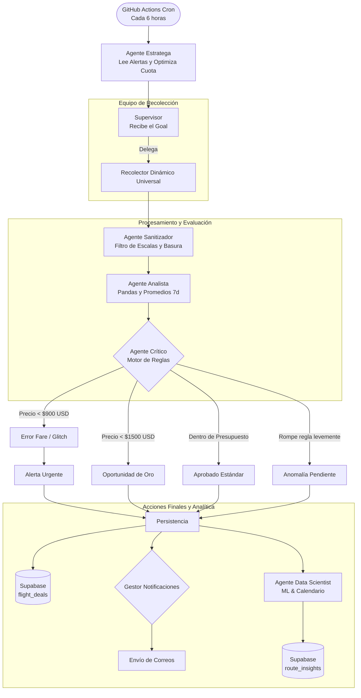

# Flight Hunter

Un sistema proactivo de rastreo y alerta de vuelos construido sobre una arquitectura de **Inteligencia Artificial Agentiva (LangGraph)**. Diseñado para buscar de manera autónoma, evaluar mediante reglas de negocio y notificar las mejores oportunidades de pasajes aéreos hacia cualquier destino global definido por el usuario.

## El Origen del Proyecto

La idea nació de una necesidad personal real: planificar unas vacaciones. En lugar de depender de alertas genéricas de sitios agregadores de viajes, decidí construir una solución propia, ajustada exactamente a fechas estrictas, un presupuesto definido y destinos de interés.

Lo que comenzó como un simple script evolucionó hasta convertirse en la excusa perfecta para consolidar arquitecturas modernas: **flujos de trabajo basados en Agentes (Agentic Workflows)**, una interfaz web inmersiva, **autenticación de usuarios** y un modelo **Serverless**. Hoy el sistema es multiusuario, leyendo de la base de datos las alertas deseadas por diferentes personas, y optimizando las llamadas a las APIs de vuelo para minimizar costos.

## Arquitectura Técnica

Flight Hunter es una aplicación full-stack completamente autónoma. El frontend captura las preferencias de los usuarios logueados, y el backend se ejecuta de forma programada, delega tareas a agentes especializados, limpia la data, evalúa los resultados con un motor de decisiones y alerta cuando surgen oportunidades reales.

### Agentes Inteligentes (LangGraph)

El núcleo del backend es un grafo de estados construido con **LangGraph** en Python:

### Roles de los Agentes

1. **Agente Estratega (Cerebro):** Se conecta a Supabase para leer todas las alertas activas de los usuarios (`search_alerts`). Traduce destinos genéricos (ej. "Europa") a aeropuertos específicos, agrupa búsquedas idénticas para no gastar cuota en vano, y define una "Misión" limitando la cantidad de peticiones para cuidar el límite de uso de SerpApi.
2. **Supervisor:** Recibe la misión optimizada y orquesta la recolección.
3. **Recolector Dinámico Universal:** Especialista en consultar rutas a nivel global de forma parametrizada. Utiliza **SerpApi** (Google Flights API).
4. **Agente Sanitizador:** Interviene para limpiar combinaciones de escalas basura, precios irrisorios falsos y viajes de duración extrema (ej. > 30hs). 
5. **Agente Analista:** Utiliza `pandas` para consolidar las distintas estructuras JSON ya sanitizadas y calcular promedios históricos (`precio_promedio_7d`).
6. **Agente Crítico:** Evalúa las ofertas contra las alertas de los usuarios y reglas de negocio:
   - **Error Fare (Glitch Fare):** Tarifa que cae por debajo de umbrales críticos.
   - **Oportunidad de Oro / Aprobado:** Cumplen con presupuesto y se guardan.
   - **Anomalía (Human-in-the-Loop):** Detecta vuelos muy económicos que rompen levemente parámetros y espera aprobación desde el frontend.
7. **Agente Data Scientist (Analítica Predictiva):** Extrae historial, utiliza `numpy` para predecir tendencias de precio y se cruza con calendarios de feriados (`holidays`).

## Stack Tecnológico

- **Orquestación (Backend):** Python + LangGraph + Pandas.
- **Motor de Ejecución:** GitHub Actions. Corre el pipeline automáticamente vía `cron`.
- **Base de Datos & Auth:** Supabase (PostgreSQL). Gestiona usuarios, alertas, y vuelos rastreados usando RLS (Row Level Security).
- **Frontend y API:** Astro desplegado en Vercel. Ofrece un dashboard de "radar" y un flujo formal de autenticación (`/login`, `/registro`, `/alertas`) basado en diseño Glassmorphism y modelos responsivos.
- **Correos Transaccionales:** Resend.

## Estructura del Repositorio

- `/backend`: Lógica de agentes en Python. Punto de entrada principal: `main.py`.
- `/frontend`: Dashboard web y Auth Flow desarrollados con Astro.
- `.github/workflows`: Definición de pipelines (cron).
- `schema.sql`: Script DDL para replicar la estructura de la base de datos en Supabase.

## Despliegue Rápido

1. **Base de Datos:** Ejecutar `schema.sql` en el SQL Editor del proyecto de Supabase.
2. **Backend (GitHub Actions):** 
   - Secretos requeridos: `SUPABASE_URL`, `SUPABASE_SERVICE_ROLE_KEY`, `RESEND_API_KEY`, `SERPAPI_KEY`.
3. **Frontend (Vercel):** 
   - Directorio raíz: `/frontend`.
   - Configurar variables: `PUBLIC_SUPABASE_URL`, `PUBLIC_SUPABASE_ANON_KEY`.

---
*Desarrollado para resolver un problema real, aprendiendo Inteligencia Artificial Agentiva en el proceso.*