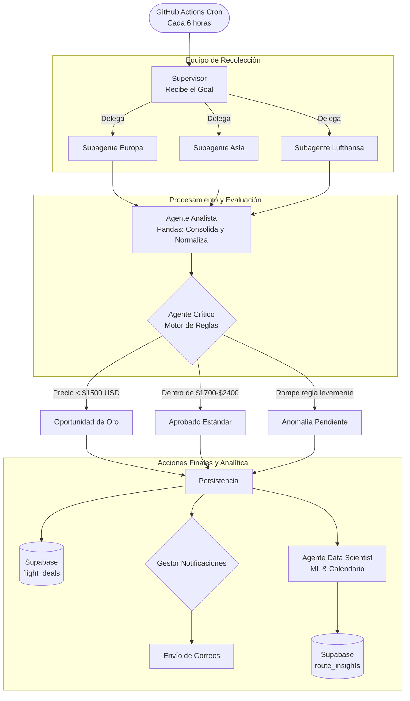

# Flight Hunter

Un sistema proactivo de rastreo y alerta de vuelos construido sobre una arquitectura de **Inteligencia Artificial Agentiva (LangGraph)**. Diseñado para buscar de manera autónoma, evaluar mediante reglas de negocio y notificar las mejores oportunidades de pasajes aéreos hacia Europa y Asia.

## El Origen del Proyecto

La idea nació de una necesidad personal real: planificar unas vacaciones. Buscar vuelos manualmente todos los días, comparar precios en diferentes pestañas y rogar cruzarse con una oferta relámpago resulta en un proceso exhaustivo. En lugar de depender de alertas genéricas de sitios agregadores de viajes, decidí construir una solución propia, ajustada exactamente a fechas estrictas, un presupuesto definido y destinos de interés.

Lo que comenzó como un simple script evolucionó hasta convertirse en la excusa perfecta para poner a prueba y consolidar arquitecturas de software modernas que venía explorando, específicamente el diseño de flujos de trabajo basados en Agentes (Agentic Workflows) y arquitecturas Serverless orientadas a eventos.

## Arquitectura Técnica

Flight Hunter es una aplicación full-stack completamente autónoma. No espera a que un usuario dispare una búsqueda; se ejecuta de forma programada, delega tareas a agentes especializados, evalúa los resultados con un motor de decisiones y alerta cuando surgen oportunidades reales.

### Agentes Inteligentes (LangGraph)

El núcleo del backend es un grafo de estados construido con **LangGraph** en Python, el cual simula el trabajo de un equipo de analistas de viaje:

### Roles de los Agentes

1. **Supervisor:** Recibe el objetivo principal (fechas, presupuesto, destinos) y orquesta la ejecución en paralelo de los recolectores.
2. **Subagentes Recolectores (Europa, Asia, Lufthansa):** Especialistas en consultar rutas específicas. Utilizan la librería `fli` (un envoltorio que hace ingeniería inversa a APIs internas de vuelos), lo que permite evadir límites de requests tradicionales y evitar costos por uso de tokens.
3. **Agente Analista:** Utiliza `pandas` para consolidar las distintas estructuras JSON devueltas por los recolectores, calcula los precios finales para múltiples pasajeros y normaliza el esquema de datos.
4. **Agente Crítico:** El motor de decisiones. Evalúa las ofertas normalizadas contra reglas de negocio estrictas:
   - **Oportunidad de Oro:** Si el precio es irrisoriamente bajo (ej. <$1500 USD total), lo aprueba y fuerza una notificación prioritaria.
   - **Aprobado:** Pasa directo a la base de datos si cumple con las fechas y presupuesto estándar.
   - **Anomalía (Human-in-the-Loop):** Detecta vuelos muy económicos que rompen levemente los parámetros (ej. salida un día antes o conexiones largas). En lugar de descartarlos, los marca para revisión humana desde el frontend, pausando esa rama del proceso hasta recibir feedback.
5. **Agente Data Scientist (Analítica Predictiva):** Se ejecuta al final del pipeline. Extrae el historial de los últimos 30 días, agrupa por ruta y utiliza `numpy` para realizar una regresión lineal (Polyfit) que predice si los precios mínimos están bajando o subiendo. Además, implementa la librería `holidays` para cruzar automáticamente las fechas de los vuelos con el calendario oficial de feriados en Argentina y el país de destino, detectando oportunidades ocultas.

## Stack Tecnológico

El sistema fue diseñado priorizando la eficiencia, los costos nulos o mínimos (Serverless) y la simplicidad operativa.

- **Orquestación (Backend):** Python + LangGraph + Pandas.
- **Motor de Ejecución:** GitHub Actions. Corre el pipeline cada 6 horas vía `cron`. Esto evita mantener servidores activos 24/7 y tolera tiempos de ejecución prolongados sin problemas de timeout.
- **Base de Datos:** Supabase (PostgreSQL). Implementa `hash_dedupe` mediante constraints de unicidad para evitar duplicar ofertas entre ejecuciones, y Row Level Security (RLS) para exponer una API de solo lectura al cliente.
- **Frontend y API:** Astro desplegado en Vercel. Presenta un dashboard inmersivo (con animaciones CSS 3D puras, diseño "Glassmorphism" y temática "Radar") para monitorear vuelos, ver estadísticas de Inteligencia Artificial de las tendencias y resolver anomalías mediante webhooks a GitHub Actions.
- **Correos Transaccionales:** Resend.

## Estructura del Repositorio

- `/backend`: Lógica de agentes en Python. Punto de entrada principal: `main.py`.
- `/frontend`: Dashboard web desarrollado con Astro.
- `.github/workflows`: Definición de los pipelines periódicos y los dispatches (webhooks).
- `schema.sql`: Script DDL para replicar la estructura de la base de datos y políticas de seguridad en Supabase.

## Despliegue Rápido

1. **Base de Datos:** Ejecutar `schema.sql` en el SQL Editor del proyecto de Supabase.
2. **Backend (GitHub Actions):** 
   - Cargar los secretos en la configuración del repositorio: `SUPABASE_URL`, `SUPABASE_SERVICE_ROLE_KEY`, `RESEND_API_KEY`, `ALERT_EMAIL_TO`, `GH_DISPATCH_TOKEN`.
3. **Frontend (Vercel):** 
   - Vincular el directorio `/frontend` a un proyecto en Vercel.
   - Configurar variables de entorno: `SUPABASE_URL`, `SUPABASE_ANON_KEY`, `SUPABASE_SERVICE_ROLE_KEY`, `GH_DISPATCH_TOKEN`, `GH_REPO`.

---
*Desarrollado para resolver un problema real, aprendiendo en el proceso.*