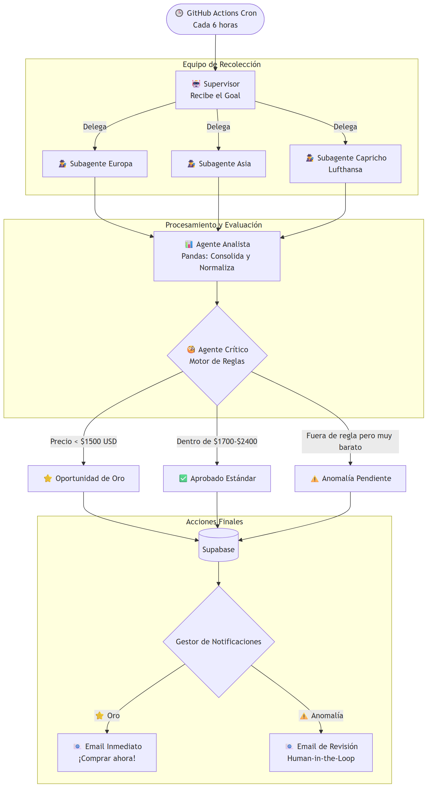
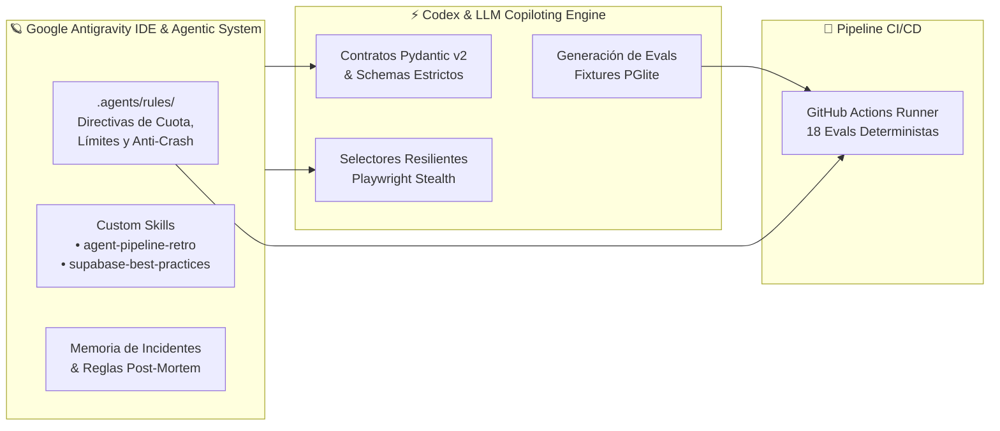
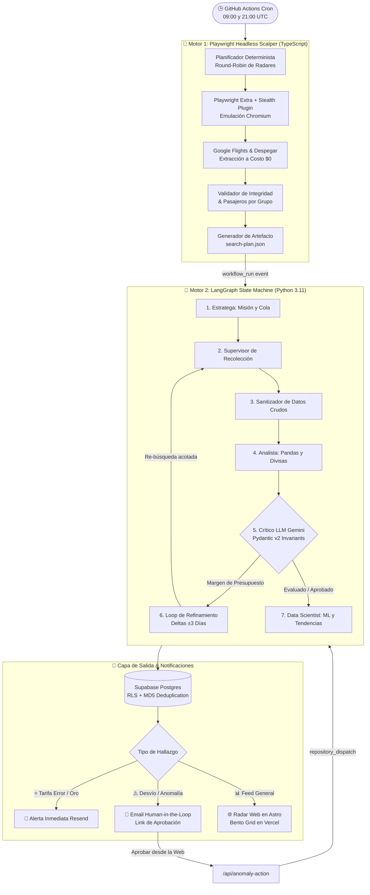
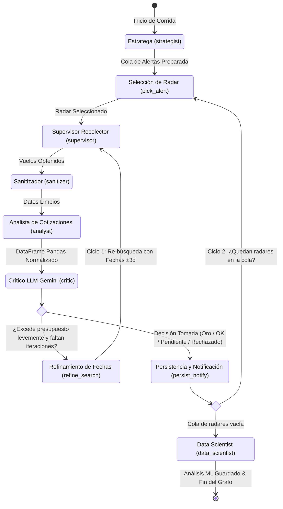
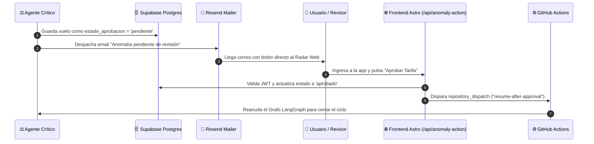

# 🛫 Fly Hunter — Autonomous Multi-Agent Flight Intelligence & Radar

<p align="center">
  
</p>

<p align="center">
  <strong>Sistema autónomo y proactivo de rastreo, evaluación y arbitraje de pasajes aéreos globales con arquitectura de Doble Motor: Playwright Headless Stealth + Máquina de Estados Cíclica en LangGraph, Razonamiento Estructurado con Gemini Flash, Suite de Evals de Comportamiento y Frontend Radar en Astro.</strong>
</p>

<p align="center">
  <a href="#-arquitectura-del-sistema-dual-engine"></a>
  <a href="#-meta-desarrollo-agente-antigravity--codex"></a>
  <a href="#-orquestaci%C3%B3n-de-agentes-y-m%C3%A1quina-de-estados-langgraph"></a>
  <a href="#-motor-1-playwright-stealth-scalper-costo-0"></a>
  <a href="#-suite-de-evaluaci%C3%B3n-offline-behavioral-evals"></a>
  <a href="#-frontend-radar-web-astro--bento-grid"></a>
  <a href="#-base-de-datos-supabase-postgresql-rls"></a>
</p>

---

## 📑 Tabla de Contenidos

1. [🎯 Visión General & Motivación](#-visión-general--motivación)
2. [🤖 Meta-Desarrollo Agente: Antigravity + Codex](#-meta-desarrollo-agente-antigravity--codex)
3. [🏗 Arquitectura del Sistema (Dual-Engine)](#-arquitectura-del-sistema-dual-engine)
4. [🧠 Orquestación de Agentes y Máquina de Estados (LangGraph)](#-orquestación-de-agentes-y-máquina-de-estados-langgraph)
   - [Diagrama de Flujo del Grafo Cíclico](#diagrama-de-flujo-del-grafo-cíclico)
   - [Desglose y Rol de Cada Agente](#desglose-y-rol-de-cada-agente)
   - [Loops Cíclicos: Self-Correction y Multi-Radar](#loops-cíclicos-self-correction-y-multi-radar)
5. [🛡️ Gestión de Cuotas, Circuit Breakers & Anti-Bot](#️-gestión-de-cuotas-circuit-breakers--anti-bot)
6. [🧪 Suite de Evaluación Offline (Behavioral Evals)](#-suite-de-evaluación-offline-behavioral-evals)
7. [👤 Human-in-the-Loop & Resolución de Anomalías](#-human-in-the-loop--resolución-de-anomalías)
8. [📊 Data Science & Modelado Predictivo de Tarifas](#-data-science--modelado-predictivo-de-tarifas)
9. [🌐 Frontend Radar (Astro + Bento Grid)](#-frontend-radar-astro--bento-grid)
10. [🎬 Estudio de Video Programático (Remotion)](#-estudio-de-video-programático-remotion)
11. [🛠 Matriz de Stack Tecnológico](#-matriz-de-stack-tecnológico)
12. [📂 Estructura del Repositorio](#-estructura-del-repositorio)
13. [🚀 Puesta en Marcha & Despliegue](#-puesta-en-marcha--despliegue)
14. [📜 Reglas de Arquitectura y Lecciones Post-Mortem](#-reglas-de-arquitectura-y-lecciones-post-mortem)

---

## 🎯 Visión General & Motivación

Buscar pasajes aéreos a precios accesibles es una tarea frustrante para cualquier viajero:
* **Precios dinámicos y opacos**: Las aerolíneas y OTAs (Online Travel Agencies) alteran tarifas en base a demanda, cookies y perfiles de usuario.
* **Limitaciones de buscadores comerciales**: Plataformas como Google Flights o Skyscanner no permiten monitoreo autónomo continuo con ventanas de fechas flexibles personalizadas por cantidad exacta de pasajeros, presupuesto real ni auto-corrección adaptativa.
* **Costos astronómicos de APIs**: Consultar inventarios aéreos en vivo mediante APIs comerciales de forma continua agota presupuestos en cuestión de días.

**Fly Hunter** resuelve este desafío combinando **automatización web de costo $0** con **inteligencia artificial agentic y grafos de decisión**:
* Monitorea rutas de alto interés (ej: Buenos Aires hacia Madrid, Barcelona, Miami o Tokio) para radares de viaje configurados en tiempo real.
* Opera bajo un **modelo híbrido resiliente**: utiliza primero extracción headless invisible para el 90% de las consultas y reserva APIs de pago (SerpApi) exclusivamente como red de seguridad respaldada por balance auditado.
* Aplica **razonamiento determinista y semántico estricto**: detecta tarifas error en microsegundos, descarta itinerarios inviables con tolerancia cero en escalas, y utiliza LLMs (Gemini Flash) bajo esquemas Pydantic v2 cerrados para decidir si vale la pena explorar fechas contiguas antes de alertar al usuario por correo o requerir aprobación humana.

---

## 🤖 Meta-Desarrollo Agente: Antigravity + Codex

Este repositorio no fue programado únicamente como un script tradicional; fue concebido, diseñado y construido utilizando **metodologías de ingeniería asistida por agentes autónomos de última generación**, apalancando de forma central **Google Antigravity** y **OpenAI Codex**:


```mermaid
flowchart LR
    subgraph Antigravity["🪐 Google Antigravity IDE & Agentic System"]
        Rules[".agents/rules/<br>Directivas de Cuota,<br>Límites y Anti-Crash"]
        Skills["Custom Skills<br>• agent-pipeline-retro<br>• supabase-best-practices"]
        Memory["Memoria de Incidentes<br>& Reglas Post-Mortem"]
    end

    subgraph Codex["⚡ Codex & LLM Copiloting Engine"]
        Contracts["Contratos Pydantic v2<br>& Schemas Estrictos"]
        DOMParsing["Selectores Resilientes<br>Playwright Stealth"]
        OfflineTests["Generación de Evals<br>Fixtures PGlite"]
    end

    subgraph CI["🚀 Pipeline CI/CD"]
        Actions["GitHub Actions Runner<br>18 Evals Deterministas"]
    end

    Antigravity --> Contracts
    Antigravity --> DOMParsing
    Codex --> OfflineTests
    OfflineTests --> Actions
    Rules --> Actions
```

### 1. Google Antigravity como IDE y Meta-Orquestador
* **Agent Skills & Reglas Especializadas (`.agents/rules/` y `.agents/skills/`)**:
  * `gemini-ai-quotas-and-limits.md`: Modelado formal de los límites de rate limiting (RPM/RPD) y políticas de batching para evitar HTTP 429 en Google AI Studio.
  * `serpapi-quota-sampling.md`: Protocolo de partición determinista round-robin sobre combinaciones de fechas y guardián de créditos `/account.json`.
  * `agent-pipeline-retro`: Skill operativo que audita las fallas en GitHub Actions y convierte automáticamente incidentes observados en tests de regresión y fixtures permanentes.
* **Codificación de Incidentes en Caliente**: Cada bug identificado durante corridas de producción (desvíos de selectores en Despegar, parseo de fechas ISO8601 en Pandas o ambigüedad regional en aeropuertos) fue codificado como una regla arquitectónica estricta en `agents.md` y un test de regresión en `shared/radar-contract-cases.json`.

### 2. OpenAI Codex & LLM Agentic Engineering
* **Generación de Contratos Estrictos con Pydantic v2**: Codex participó en el diseño del contrato `RefinementDecision` con invariantes de acción (`validate_action`), garantizando que el LLM nunca pueda emitir razonamientos no tipados ni modificar reglas de negocio.
* **Evasión Stealth y Selectores Polimórficos**: Co-diseño de los adaptadores de Playwright para Google Flights y Despegar, implementando emulación de comportamiento humano, evasión de DataDome y extracción de cotizaciones exactas con desglose de pasajeros.
* **Test-Driven Agent Development (TDD)**: Construcción de una suite de evaluación offline de 18 pruebas unitarias y de comportamiento (`evals/test_critic_decisions.py`) para validar el comportamiento del agente sin consumir tokens ni APIs externas.

---

## 🏗 Arquitectura del Sistema (Dual-Engine)

El sistema implementa una arquitectura desacoplada de **Doble Motor** con orquestación serverless en GitHub Actions:


```mermaid
flowchart TD
    Cron([🕒 GitHub Actions Cron<br>09:00 y 21:00 UTC]) --> M1

    subgraph M1["🚗 Motor 1: Playwright Headless Scalper (TypeScript)"]
        PlannerTS[Planificador Determinista<br>Round-Robin de Radares]
        Browser[Playwright Extra + Stealth Plugin<br>Emulación Chromium]
        Sources[Google Flights & Despegar<br>Extracción a Costo $0]
        QuoteVal[Validador de Integridad<br>& Pasajeros por Grupo]
        PlanArtifact[Generador de Artefacto<br>search-plan.json]

        PlannerTS --> Browser --> Sources --> QuoteVal --> PlanArtifact
    end

    PlanArtifact -->|workflow_run event| M2

    subgraph M2["🧠 Motor 2: LangGraph State Machine (Python 3.11)"]
        direction TB
        Estratega[1. Estratega: Misión y Cola]
        Supervisor[2. Supervisor de Recolección]
        Sanitizer[3. Sanitizador de Datos Crudos]
        Analyst[4. Analista: Pandas y Divisas]
        Critic{5. Crítico LLM Gemini<br>Pydantic v2 Invariants}
        Refine[6. Loop de Refinamiento<br>Deltas ±3 Días]
        DataScientist[7. Data Scientist: ML y Tendencias]

        Estratega --> Supervisor --> Sanitizer --> Analyst --> Critic
        Critic -->|Margen de Presupuesto| Refine -->|Re-búsqueda acotada| Supervisor
        Critic -->|Evaluado / Aprobado| DataScientist
    end

    M2 --> DB[(Supabase Postgres<br>RLS + MD5 Deduplication)]

    subgraph Out["📢 Capa de Salida & Notificaciones"]
        DB --> Filter{Tipo de Hallazgo}
        Filter -->|⭐ Tarifa Error / Oro| Resend[📧 Alerta Inmediata Resend]
        Filter -->|⚠️ Desvío / Anomalía| HITL[📧 Email Human-in-the-Loop<br>Link de Aprobación]
        Filter -->|📊 Feed General| AstroApp[🌐 Radar Web en Astro<br>Bento Grid en Vercel]
    end

    HITL -->|Aprobar desde la Web| AstroAPI["/api/anomaly-action"]
    AstroAPI -->|repository_dispatch| M2
```

### Motor 1: Scalper Headless a Costo $0 (Node.js / TypeScript)
* **Objetivo**: Extraer cientos de combinaciones de precios sin depender de créditos de API.
* **Stack**: `Playwright Extra` + `Puppeteer Stealth Plugin` + `Node.js 22` + `TypeScript 5.7`.
* **Mecanismos clave**:
  * Bypass de anti-bots (Cloudflare / DataDome) en Despegar y Google Flights.
  * Extracción del precio total verificado según la cantidad real de adultos del radar (evita el bug común de enlaces a cotizaciones para 1 solo pasajero).
  * Genera el contrato `search-plan.json` que es compartido como artefacto de CI con el motor de Python.

### Motor 2: Inteligencia de Grafos Cíclicos (Python / LangGraph)
* **Objetivo**: Evaluar los datos con lógica de negocio inviolable, ejecutar auto-corrección semántica y calcular modelos predictivos.
* **Stack**: `Python 3.11` + `LangGraph` + `Pydantic v2` + `Pandas` + `Google Gemini API` (`gemini-2.5-flash`).
* **Mecanismos clave**:
  * Máquina de estados con loops condicionales finitos.
  * Respaldo por SerpApi condicionado estrictamente al balance de cuenta `/account.json`.
  * Filtros de early-return (tarifas error < US$ 400 y tolerancia cero a $\ge 2$ escalas).

---

## 🧠 Orquestación de Agentes y Máquina de Estados (LangGraph)

La toma de decisiones de Fly Hunter no reside en un simple prompt de texto. Es una **máquina de estados cíclica implementada en LangGraph** donde cada nodo posee un rol único, contratos tipados y límites operativos inquebrantables.

### Diagrama de Flujo del Grafo Cíclico


```mermaid
stateDiagram-v2
    [*] --> strategist_node: Inicio de Corrida

    state "Estratega (strategist)" as strategist_node
    state "Selección de Radar (pick_alert)" as pick_alert_node
    state "Supervisor Recolector (supervisor)" as supervisor_node
    state "Sanitizador (sanitizer)" as sanitizer_node
    state "Analista de Cotizaciones (analyst)" as analyst_node
    state "Crítico LLM Gemini (critic)" as critic_node
    state "Refinamiento de Fechas (refine_search)" as refine_search_node
    state "Persistencia y Notificación (persist_notify)" as persist_node
    state "Data Scientist (data_scientist)" as data_scientist_node

    strategist_node --> pick_alert_node: Cola de Alertas Preparada
    pick_alert_node --> supervisor_node: Radar Seleccionado

    supervisor_node --> sanitizer_node: Vuelos Obtenidos
    sanitizer_node --> analyst_node: Datos Limpios
    analyst_node --> critic_node: DataFrame Pandas Normalizado

    state critic_decision <<choice>>
    critic_node --> critic_decision

    critic_decision --> refine_search_node: ¿Excede presupuesto levemente y faltan iteraciones?
    refine_search_node --> supervisor_node: Ciclo 1: Re-búsqueda con Fechas ±3d

    critic_decision --> persist_node: Decisión Tomada (Oro / OK / Pendiente / Rechazado)

    state persist_decision <<choice>>
    persist_node --> persist_decision

    persist_decision --> pick_alert_node: Ciclo 2: ¿Quedan radares en la cola?
    persist_decision --> data_scientist_node: Cola de radares vacía

    data_scientist_node --> [*]: Análisis ML Guardado & Fin del Grafo
```

---

### Desglose y Rol de Cada Agente

| Agente | Implementación | Responsabilidad Principal | Reglas & Contratos Clave |
| :--- | :--- | :--- | :--- |
| **🧠 Estratega** | `backend/src/agents/strategist.py` | Lee Supabase, define la misión del día y ordena la cola de radares activos. | Aplica partición determinista sobre la ventana temporal y define el `budgetScope` por radar. |
| **🕵️ Supervisor & Recolectores** | `backend/src/agents/collectors.py` | Gestiona la recolección híbrida reutilizando la caché de Playwright a costo $0. | Consulta `/account.json` en SerpApi antes de cualquier llamada paga; bloquea si restan $\le 2$ créditos. |
| **🧼 Sanitizador** | `backend/src/agents/sanitizer.py` | Normalización de payloads, limpieza de caracteres Unicode y verificación de tipos. | Descarta vuelos sin precio comprobable (`flight.price_unknown`) o con atributos malformados. |
| **📊 Analista** | `backend/src/agents/analyst.py` | Normaliza monedas a USD/ARS oficial y calcula precio por pasajero unitario con Pandas. | Nunca multiplica un total ya cotizado por el número de pasajeros; garantiza paridad cambiaria exacta. |
| **⚖️ Crítico (LLM)** | `backend/src/agents/critic.py` | Aplica filtros duros y razona con Gemini Flash sobre candidatos de fechas contiguas. | Esquema estricto `RefinementDecision` en Pydantic v2. No puede aprobar vuelos: solo propone deltas de fecha. |
| **📈 Data Scientist** | `backend/src/agents/data_scientist.py` | Ejecuta modelos estadísticos sobre los últimos 30 días de historial en Supabase. | Regresión lineal OLS (`numpy.polyfit`) para pendientes de precio, medias móviles de 7 días y feriados con `holidays`. |
| **💾 Persistencia & Notificaciones** | `backend/src/services/db.py` & `notifications.py` | Ejecuta upserts en Supabase con hash MD5 y despacha alertas por correo vía Resend. | Anti-spam durable: marca `notificado = true` en base de datos inmediatamente tras enviar el email. |

---

### Loops Cíclicos: Self-Correction y Multi-Radar

#### 1. Loop 1: Auto-Corrección Bounded (Self-Correction Loop)
Cuando una tarifa excede el presupuesto por un margen estrecho ($\le 25\%$), el Crítico no descarta la oportunidad a ciegas:
1. **Generación Determinista de Candidatos**: El código calcula candidatos de fechas alternativas dentro de la ventana de viaje permitida (respetando días de estadía y evitando retornos caros en domingo).
2. **Razonamiento del LLM sobre Candidatos**: Se invoca a Gemini Flash con un prompt de sistema rígido y Pydantic v2. El modelo selecciona el mejor candidato justificando la incertidumbre y evidencia.
3. **Validación Invariable de Pydantic**:
   ```python
   class RefinementDecision(BaseModel):
       model_config = ConfigDict(extra="forbid", strict=True)
       needs_refinement: bool
       dep_delta: int = Field(ge=-3, le=3)
       ret_delta: int = Field(ge=-3, le=3)
       refinement_reason: str = Field(min_length=1, max_length=500)
       evidence: List[str] = Field(min_length=1, max_length=3)
       uncertainty: str = Field(min_length=1, max_length=300)

       @model_validator(mode="after")
       def validate_action(self) -> "RefinementDecision":
           if self.needs_refinement != bool(self.dep_delta or self.ret_delta):
               raise ValueError("Refining requires nonzero deltas; stopping requires zero deltas")
           return self
   ```
4. **Circuit Breaker**: El loop está limitado a 2 iteraciones (`max_iterations = 2`).
5. **Retención de Ofertas (`retained_deals`)**: Si la búsqueda refinada arroja un precio peor o inventario vacío, el grafo conserva intacta la mejor opción hallada previamente.

#### 2. Loop 2: Multi-Radar Queue Iterator
El grafo no se apaga tras procesar un único destino. Encola todas las alertas activas registradas por los usuarios en Supabase (`alerts_queue`) y cicla ordenadamente entre ellas antes de avanzar al nodo analítico de Data Science.

---

## 🛡️ Gestión de Cuotas, Circuit Breakers & Anti-Bot

Fly Hunter está diseñado para funcionar en producción de forma ininterrumpida sin generar sorpresas en facturación:

```mermaid
flowchart TD
    Req[Solicitud de Búsqueda de Vuelo] --> CacheCheck{¿Existe en Caché Playwright?}
    CacheCheck -->|Sí (Costo $0)| UseCache[Consumir Dato Local Fresco]
    CacheCheck -->|No| SerpCheck{¿SerpApi Habilitado?}
    
    SerpCheck -->|Sí| AccountQuery["Auditoría Gratuita /account.json"]
    AccountQuery --> Balance{Créditos Restantes}
    Balance -->|<= 2 Créditos| CircuitOpen[🚨 Abrir Circuit Breaker<br>Bloqueo hasta el 23 del mes]
    Balance -->|> 2 Créditos| SerpFetch[Ejecutar Búsqueda en SerpApi]
    
    CircuitOpen --> FallbackScrape[Ejecutar Scraper Playwright Stealth]
    
    GeminiReq[Llamada a Gemini LLM] --> RateCheck{Tokens y RPM Disponibles}
    RateCheck -->|HTTP 429 o Excedido| FallbackHeuristic[Fallback a Reglas Heurísticas Deterministas]
    RateCheck -->|Dentro de Límite| LLMSuccess[Razonamiento Pydantic Exitoso]
```

### Matriz de Gobernanza de Cuotas

| Proveedor / API | Límite Oficial | Estrategia de Mitigación en Fly Hunter |
| :--- | :--- | :--- |
| **SerpApi** | 250 consultas / mes (renueva el día 23). | **Consulta previa sin costo (`/account.json`)**: Si restan $\le 2$ créditos, bloquea SerpApi inmediatamente y conmuta 100% a Playwright a costo $0. Emplea rotación Round-Robin (`día % N`) para no quemar cuota en un solo destino. |
| **Google AI Studio (Gemini)** | 20 RPD / 5 RPM (Free Tier). | **Batching por Alerta**: Se evalúan todos los vuelos de un radar en 1 sola llamada estructurada (4 a 8 llamadas diarias reales). Fallback transparente a reglas de calendario si ocurre HTTP 429. |
| **Google Flights / Despegar** | Rate-limit por IP / Anti-bot (DataDome). | **Playwright Extra + Stealth**: Emulación de User-Agent real, deshabilitación de WebGL fingerprints, pausas estocásticas y topes estrictos (4 Google / 2 Despegar por corrida). |

---

## 🧪 Suite de Evaluación Offline (Behavioral Evals)

Para garantizar que los agentes no alucinen ni violen reglas de negocio críticas, el repositorio cuenta con una suite completa de pruebas unitarias y de comportamiento offline en Python y TypeScript.

> 💡 **Principio de Aislamiento**: Los evals corren sin conexión a internet, sin consumir API keys ni tokens de LLMs, y utilizan `@electric-sql/pglite` para simular PostgreSQL y políticas RLS en memoria durante CI.

```bash
# Ejecutar suite de evals del Crítico en Python:
python -B evals/test_critic_decisions.py

# Ejecutar evals de orquestación y contratos:
python -B evals/test_search_orchestration.py
python -B evals/test_collection_context.py

# Ejecutar tests TypeScript con PGlite:
cd agent && npm test
```

### Casos Borde Auditados (18 Tests Automáticos del Crítico)

* ⚡ **Detección Instantánea de Tarifa Error (< US$ 400 por pax)**: Se aprueba en microsegundos mediante código determinista antes de tocar el LLM.
* 🛑 **Tolerancia Cero en Escalas**: Vuelos con $\ge 2$ escalas son descartados inmediatamente sin importar qué tan barato sea el precio.
* 🚫 **Filtro Preventivo de Aerolíneas Excluidas**: Transportistas vetados por el usuario (ej: `LEVEL` o itinerarios combinados) se eliminan antes de que el agente tenga visibilidad.
* 🔒 **Validación Estricta de Esquema Pydantic**: Rechazo inmediato ante payloads con deltas fuera de rango ($\pm 3$ días), justificaciones vacías o incertidumbre omitida.
* 🔁 **Límite Inflexible de Refinamientos**: El loop se clausura obligatoriamente al agotar los 2 intentos permitidos.

---

## 👤 Human-in-the-Loop & Resolución de Anomalías

No todas las situaciones son blancas o negras. Cuando el sistema encuentra un vuelo con un **desvío menor admitido** (por ejemplo, una tarifa excelente 1 día fuera de la ventana preferida):


```mermaid
sequenceDiagram
    autonumber
    participant Agent as ⚖️ Agente Crítico
    participant DB as 🗄️ Supabase Postgres
    participant Resend as 📧 Resend Mailer
    participant User as 👤 Usuario / Revisor
    participant Astro as 🌐 Frontend Astro (/api/anomaly-action)
    participant GH as ⚙️ GitHub Actions

    Agent->>DB: Guarda vuelo como estado_aprobacion = 'pendiente'
    Agent->>Resend: Despacha email "Anomalía pendiente de revisión"
    Resend->>User: Llega correo con botón directo al Radar Web
    User->>Astro: Ingresa a la app y pulsa "Aprobar Tarifa"
    Astro->>DB: Valida JWT y actualiza estado a 'aprobado'
    Astro->>GH: Dispara repository_dispatch ("resume-after-approval")
    GH->>Agent: Reanuda el Grafo LangGraph para cerrar el ciclo
```

* **Seguridad Criptográfica**: El endpoint `/api/anomaly-action` en Astro implementa rate-limiting en memoria por IP, validación de sesiones JWT contra Supabase Auth y comparación segura contra ataques de temporización (`timingSafeEqual`) para tokens administrativos.

---

## 📊 Data Science & Modelado Predictivo de Tarifas

El nodo `data_scientist.py` opera como un analista cuantitativo continuo sobre el historial de pasajes almacenado:

1. **Detección Automática de Feriados**:
   Utiliza la biblioteca `holidays` para contrastar códigos IATA de origen y destino contra calendarios oficiales (ej: feriados nacionales en Argentina, España, EE.UU. o Japón), etiquetando las columnas `es_feriado_origen` y `es_feriado_destino`.
2. **Promedios Móviles de 7 Días**:
   Calcula la media móvil semanal de cada ruta para aislar oscilaciones de corto plazo frente a cambios reales de tendencia.
3. **Regresión Lineal OLS (`numpy.polyfit`)**:
   Calcula la pendiente matemática ($\text{slope}$) del precio a lo largo del tiempo:
   $$\text{Tendencia} = \text{slope} \times 86400 \quad \text{(Variación estimada en USD / día)}$$
   Permite al usuario conocer si el precio de una ruta se encuentra en caída libre o en tendencia alcista.

---

## 🌐 Frontend Radar (Astro + Bento Grid)

El frontend de Fly Hunter fue construido bajo una estética de vanguardia inspirada en tarjetas de embarque digitales y tableros aeroespaciales:

* **Arquitectura Híbrida en Astro 7**: Combina Server-Side Rendering (SSR) en Vercel con hidratación granular en el cliente para sincronizar datos frescos en `onMount`.
* **Diseño Bento Grid & Glassmorphism**: Tarjetas con efectos de desenfoque de fondo (*backdrop-filter*), bordes sutiles y contraste optimizado para modo oscuro.
* **Split-State UX**: Separación tajante entre el modo de configuración inicial de radares y el dashboard activo de solo lectura con edición granular por bloques.
* **Countdown Dinámico**: Reloj regresivo sincronizado matemáticamente con los horarios de ejecución de los crons de GitHub Actions (09:00 y 21:00 UTC).
* **Iconografía Homogénea**: Implementación estricta de [Phosphor Icons](https://phosphoricons.com/) (`<i class="ph ph-[icono]"></i>`), eliminando emojis del sistema operativo.
* **Formateo Monetario Regional**: Uso de `Intl.NumberFormat('es-AR')` para renderizar `US$ 2.400` con separadores adecuados.
* **Sistema de Toasts Integrado**: Prohibición de `alert()` nativo de JavaScript; retroalimentación mediante notificaciones no bloqueantes.

---

## 🎬 Estudio de Video Programático (Remotion)

El repositorio incluye un proyecto completo en `/video` construido con **Remotion 4**, **React 19** y **Tailwind CSS v4** para compilar y generar videos promocionales animados del sistema directamente desde código:

* **Renderizado Determinista de Video**: Genera clips en MP4 de alta resolución mostrando la búsqueda de ofertas, las alertas y la arquitectura técnica.
* **Integración con Tailwind v4 & Zod**: Tipado estricto de las props de animación y estilos visuales coincidentes con el diseño del Radar Web.

```bash
# Iniciar Remotion Studio para previsualizar el video interactivo:
cd video
npm run dev
```

---

## 🛠 Matriz de Stack Tecnológico

| Dominio | Tecnología / Herramienta | Versión | Rol en el Proyecto |
| :--- | :--- | :--- | :--- |
| **Meta-Desarrollo Agente** | Google Antigravity & OpenAI Codex | Native | Diseño de arquitectura, reglas de incidentes, prompts estructurados y evals. |
| **Orquestación de Grafos** | LangGraph & LangChain Core | 0.2+ | Máquina de estados cíclica con loops de refinamiento y multi-alerta. |
| **Modelos de Lenguaje** | Google Gemini API (`@google/genai`) | 2.5 Flash | Razonamiento semántico de candidatos de calendario bajo Pydantic v2. |
| **Contratos y Validación** | Pydantic v2 | 2.10+ | Schemas estrictos (`extra="forbid"`) con invariantes de acción obligatorias. |
| **Automatización Web** | Playwright Extra + Stealth Plugin | 1.50+ | Extracción headless a costo $0 en Google Flights y Despegar evadiendo anti-bots. |
| **Ciencia de Datos** | Pandas + NumPy + Holidays | Latest | Time-series, regresión lineal OLS, medias móviles y detección de feriados. |
| **Base de Datos & Auth** | Supabase (PostgreSQL 15) | Cloud | Deduplicación MD5, Row Level Security (RLS) y almacenamiento de cotizaciones. |
| **Pruebas en Memoria** | ElectricSQL PGlite | 0.5.8 | Emulación local de Postgres y RLS para tests de CI sin tocar la base real. |
| **Frontend Framework** | Astro + TypeScript | 7.2+ | Radar Bento Grid con Glassmorphism, SSR y endpoints API en Vercel. |
| **Video en Código** | Remotion + React 19 | 4.0+ | Generación programática de videos promocionales del sistema. |
| **Notificaciones** | Resend API | Latest | Entrega de correos transaccionales para oportunidades de oro y anomalías. |
| **CI/CD & Serverless** | GitHub Actions | Workflows | Cronjobs autónomos (`agent-hunt.yml` y `pipeline.yml`), Bandit y NPM Audit. |

---

## 📂 Estructura del Repositorio

```text
FLY-HUNTER/
├── .agents/                        # Meta-memoria y directivas de ingeniería de agentes
│   ├── rules/                      # Reglas de cuotas, anti-crash y directivas de prompts
│   │   ├── bugs_y_arquitectura.md
│   │   ├── gemini-ai-quotas-and-limits.md
│   │   └── serpapi-quota-sampling.md
│   └── skills/                     # Skills para retro de incidentes y Supabase
├── .github/workflows/              # Orquestación de CI/CD Serverless
│   ├── agent-hunt.yml              # Corre el Motor 1 de Playwright (TypeScript)
│   ├── pipeline.yml                # Corre el Motor 2 de LangGraph (Python)
│   ├── quality.yml                 # Suite de contratos offline en CI
│   └── security.yml                # Análisis de vulnerabilidades con Bandit y NPM Audit
├── agent/                          # 🚗 Motor 1: Scalper Headless & Planificador
│   ├── src/
│   │   ├── skills/googleFlights.ts # Adaptador Stealth para Google Flights
│   │   ├── skills/despegar.ts      # Adaptador Stealth para Despegar
│   │   ├── agent/searchPlanner.ts  # Generador determinista del espacio de búsqueda
│   │   ├── agent/quotePolicy.ts    # Validador de integridad de cotizaciones
│   │   └── index.ts                # Entrypoint del cazador de vuelos
│   └── tests/                      # Tests TypeScript con PGlite offline
├── backend/                        # 🧠 Motor 2: Grafo Cíclico en LangGraph
│   ├── src/
│   │   ├── agents/
│   │   │   ├── strategist.py       # Nodo 1: Definición de misión y radares
│   │   │   ├── collectors.py       # Nodo 2: Recolección y escudo de SerpApi
│   │   │   ├── sanitizer.py        # Nodo 3: Limpieza y normalización
│   │   │   ├── analyst.py          # Nodo 4: Normalización monetaria y Pandas
│   │   │   ├── critic.py           # Nodo 5: Razonamiento Gemini y Pydantic v2
│   │   │   └── data_scientist.py   # Nodo 7: ML, regresión OLS y feriados
│   │   ├── services/               # Supabase, Divisas y Notificaciones Resend
│   │   ├── graph.py                # Definición de nodos, edges y loops en LangGraph
│   │   └── main.py                 # Entrypoint del pipeline Python
│   └── requirements.txt            # Dependencias del backend
├── evals/                          # 🧪 Suite de Evals de Comportamiento Offline
│   ├── test_critic_decisions.py    # 18 pruebas automáticas para el Agente Crítico
│   ├── test_collection_context.py  # Pruebas de contexto y cuotas
│   └── test_search_orchestration.py# Pruebas de orquestación de búsqueda
├── frontend/                       # 🌐 Radar Web en Astro con Bento Grid
│   ├── src/
│   │   ├── pages/index.astro       # Dashboard principal del radar
│   │   ├── pages/api/              # Endpoint seguro para resolver anomalías
│   │   └── components/SearchWidget # Widget interactivo de búsqueda
│   └── package.json
├── video/                          # 🎬 Video Promocional en Remotion (React 19)
│   ├── src/FlyHunterPromo.tsx      # Composición de video en código
│   └── package.json
├── shared/                         # Catálogo geográfico y contratos compartidos
│   ├── radar-geography.json        # IATAs, regiones y metrópolis válidas
│   └── radar-contract-cases.json   # Fixtures de incidentes codificados
├── schema.sql                      # Esquema relacional y políticas RLS de Supabase
├── agents.md                       # Manifiesto de reglas de desarrollo y operación
└── README.md                       # Documentación principal
```

---

## 🚀 Puesta en Marcha & Despliegue

### 1. Requisitos Previos
* **Node.js**: v22.x o superior
* **Python**: v3.11.x
* **Cuenta de Supabase** (con proyecto Postgres configurado)
* **API Keys**: Google Gemini (AI Studio), Resend y SerpApi (opcional para fallback)

### 2. Configuración de Variables de Entorno

Crear un archivo `.env` en `backend/` y en `agent/`:

```env
# Supabase
SUPABASE_URL="https://tu-proyecto.supabase.co"
SUPABASE_SERVICE_ROLE_KEY="tu-service-role-key"
SUPABASE_ANON_KEY="tu-anon-key"

# Modelos LLM
GEMINI_API_KEY="tu-gemini-api-key"
GEMINI_MODEL="gemini-2.5-flash"

# Proveedores de Respaldo y Notificación
SERPAPI_KEY="tu-serpapi-key"
RESEND_API_KEY="tu-resend-api-key"
ALERT_EMAIL_TO="tu-email@dominio.com"

# Seguridad y Human-in-the-Loop
ADMIN_TOKEN="token-secreto-para-aprobar-anomalias"
GH_DISPATCH_TOKEN="tu-github-personal-access-token"
GH_REPO="usuario/fly-hunter"
```

### 3. Instalación y Ejecución Local

#### Motor 1 (TypeScript / Playwright):
```bash
cd agent
npm install
npx playwright install chromium --with-deps

# Ejecutar una simulación sin consumir proveedores (Dry Run):
npm run plan

# Ejecutar el cazador completo en modo headless:
npm run hunt
```

#### Motor 2 (Python / LangGraph):
```bash
cd backend
python -m venv .venv
source .venv/bin/activate  # En Windows: .venv\Scripts\activate
pip install -r requirements.txt

# Ejecutar el pipeline de grafos:
python -m src.main
```

#### Frontend Radar (Astro):
```bash
cd frontend
npm install
npm run dev
# Abrir en http://localhost:4321
```

---

## 📜 Reglas de Arquitectura y Lecciones Post-Mortem

El sistema opera bajo **27 reglas críticas inmutables** nacidas de incidentes reales en producción:

1. **Tolerancia Cero en Escalas**: Cualquier vuelo con $\ge 2$ escalas se descarta al inicio del Crítico mediante regla de early return; nunca se rescata.
2. **Prioridad Absoluta de Aerolíneas Excluidas**: El filtro de aerolíneas vetadas se ejecuta *antes* de que el modelo LLM tenga visibilidad de las opciones.
3. **Persistencia antes de I/O**: Cada intento de búsqueda descuenta su cuota antes de ejecutar llamadas de red; si un proceso se cae, no queda atrapado en un bucle infinito sobre la misma combinación.
4. **Anti-Spam Garantizado en Emails**: Toda notificación por correo se acopla inmediatamente a un `mark_as_notified` en Supabase para evitar duplicados en loops del grafo.
5. **Geografía No es Conectividad**: El catálogo compartido (`radar-geography.json`) valida existencia de aeropuertos, no rutas directas; nunca se descarta un aeropuerto por no tener vuelo sin escalas si existe una conexión válida de 1 escala.
6. **Aislamiento de Proyecto en Supabase**: Los agentes verifican que el `project_ref` coincida con el entorno autorizado antes de ejecutar migraciones DDL.
7. **Diseño Visual sin Emojis Nativos**: Se utiliza exclusivamente [Phosphor Icons](https://phosphoricons.com/) para preservar una apariencia premium y coherente.

---

<p align="center">
  Diseñado y construido con precisión por un equipo de ingeniería impulsado por <strong>Google Antigravity</strong> y <strong>OpenAI Codex</strong>.
</p>