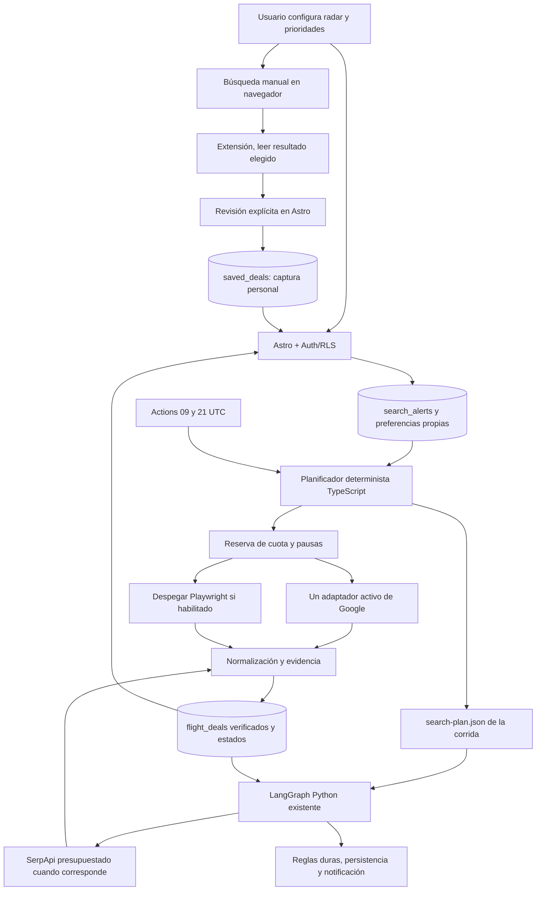

# Flight Hunter: fuentes y arquitectura para uso personal sin abono

Investigación: 15/09/2026. Presupuesto confirmado por el usuario: US$0 mensuales.
Este documento contiene evidencia y decisiones propuestas. La secuencia de implementación
vive únicamente en `MONITORING.md`, sección «Plan personal sin abono». El prompt de entrega
está en `GEMINI_HANDOFF.md`. No reemplaza `agents.md` ni describe funcionalidades ya desplegadas.

## Decisión recomendada

El proyecto puede convertirse en un monitor útil con presupuesto cero, si concentra sus
consultas en unas pocas combinaciones y muestra honestamente qué pudo verificar. No encontré
una API gratuita, de alta inmediata y cobertura completa que garantice las promociones de
Despegar, Turismocity y Aerolíneas para todas las fechas y pasajeros.

Recomiendo conservar Astro + Supabase + Actions + el grafo Python actual. Prioridades:

- Explotar bien el cupo gratuito de SerpApi ya integrado, sin cambiar los topes vigentes.
- Evaluar **fli** como alternativa experimental de acceso a Google; **fast-flights** como
  segundo candidato de evaluación, no como segundo recolector automático acumulativo.
- Terminar la captura asistida de una página que el usuario abrió y revisó personalmente.
- Distinguir pistas, precios desde la búsqueda, itinerarios completos y capturas personales.
- Reducir el conjunto prioritario; conservar la exploración amplia con cobertura explícita.
- Usar los avisos nativos de Google Flights como respaldo personal externo al proyecto.

Una librería gratuita evita pagar por software; no convierte el inventario comercial en
datos abiertos. Un MCP es una interfaz de herramientas, no una fuente adicional de tarifas.

## Qué comprobé y qué sigue sin comprobarse

Se revisaron páginas oficiales, documentación y repositorios originales, junto con el código
local y la auditoría previa de Actions. No se instalaron los candidatos, no se ejecutaron
sus búsquedas, no se compraron servicios, no se crearon cuentas y no se accedió al código
privado de competidores. Las capacidades de los repositorios son declaraciones documentadas,
no resultados de un benchmark realizado aquí. Precios/cupos deben reconfirmarse al activar cuentas.

La auditoría del 14/09 documenta el bloqueo de Despegar para EZE–MAD 18/04/2027–01/05/2027,
dos adultos. En la navegación manual de Aerolíneas se observó US$2.336,60 para esos pasajeros,
tarifa Base, vuelos AR1134/AR1133 directos. Esto demuestra una consulta puntual en navegador;
no demuestra acceso desde Actions, vigencia posterior ni igualdad con la tarifa de Despegar.
Ver `SEARCH_RELIABILITY.md` para evidencia y enlaces de las corridas.

## La referencia flighthunters.club

Su web declara Google Flights como fuente, dos búsquedas diarias, hasta tres alertas, emails
y un puntaje que considera precio histórico, ahorro, duración y escalas. Publica siete días
de prueba y un plan de «$80.000/año», importe copiado con la moneda tal como aparece, sin
suponer una divisa que la página no explicita. [Web oficial](https://www.flighthunters.club/).

Es una referencia de producto parecida. No publica en esa página la API, librería, contrato,
cuota, precisión real ni arquitectura interna. No corresponde afirmar que usa SerpApi, fli
o un scraper particular. Tampoco su ejemplo de precio prueba disponibilidad para tu viaje.

Inferencia de diseño: limitar alertas y rutas facilita concentrar capacidad. Podemos adoptar
ese principio y una explicación de valor basada en evidencia, sin copiar la marca ni inventar
históricos. El sitio es un servicio por suscripción; no es un proyecto abierto identificado.

## APIs y servicios: selección para presupuesto cero

| Opción | Acceso/costo documentado | Utilidad para Flight Hunter | Decisión |
|---|---|---|---|
| [SerpApi](https://serpapi.com/pricing) | Plan Free: 250 búsquedas/mes; requiere cuenta y clave | Respaldo estructurado de Google, ya presente en Python | Primera opción de API con cupo gratuito; verificar saldo real de la cuenta |
| [Aviasales Data API](https://support.travelpayouts.com/hc/en-us/articles/203956163-Aviasales-Data-API) | Token de Travelpayouts; datos de caché de búsquedas, retenidos siete días | Inspiración para destinos/fechas; no prueba precio actual para dos personas | Opcional, solo como pista; comprobar acceso de cuenta y utilidad en Argentina antes de integrar |
| [Aviasales Search API](https://support.travelpayouts.com/hc/en-us/articles/210995808-How-to-get-access-to-the-Aviasales-Search-API) | Exige al menos 50.000 usuarios activos mensuales | Búsqueda comercial | Descartada para este uso personal |
| [Skyscanner Travel APIs](https://developers.skyscanner.net/docs/getting-started/authentication) | Solicitud y aprobación del equipo de partners | Inventario de metabuscador; acceso no garantizado | No hacer depender el MVP de su aprobación |
| [Despegar Flights API](https://api-docs.despegar.com/docs/Flight) | Documentación para partners, no credenciales públicas | Inventario regional potencialmente relevante | Evaluar a futuro si conceden acceso; no asumir promociones minoristas idénticas |
| [Duffel](https://duffel.com/pricing) | Cuenta activada para modo live; cobra exceso de búsquedas a US$0,005 por búsqueda sobre relación 1500:1 respecto de órdenes | API orientada a venta/reserva | No usar como base del plan US$0 de monitoreo sin ventas |
| [Amadeus](https://developers.amadeus.com/self-service/apis-docs/guides/developer-guides/examples/) | El portal oficial anuncia la discontinuación de Self-Service el 17 de julio; ahora orienta a Enterprise | Los tutoriales antiguos de alta Self-Service ya no son una base vigente | Descartar la recomendación antigua de API personal fácil |
| [SearchApi](https://www.searchapi.io/google-flights-api) | Ofrece 100 solicitudes gratuitas para comenzar | Otra vía a Google | Prueba inicial; no se verificó un cupo gratuito mensual recurrente |
| [Apify](https://apify.com/pricing) | Free: US$5 de créditos/mes; el costo depende del Actor y su consumo | Probar un extractor gestionado | Laboratorio opcional, no garantía de capacidad mensual ni de código abierto |
| [Google Flights, seguimiento nativo](https://support.google.com/travel/answer/6235879?hl=en) | Función de seguimiento con cuenta Google | Avisos personales por rutas/fechas y cambios relevantes | Respaldo inmediato fuera del pipeline; no es una API para copiar a Supabase |

Sobre SerpApi: los 250 créditos son el plan publicado, **no el saldo de tu cuenta**. El código
ya limita a 2 intentos/corrida, 4/día y 220/ciclo, además de reserva. No crear varias cuentas
ni nuevas claves para eludir esos límites. Cuatro diarios durante 30 días serían como máximo
120 intentos, antes de considerar disponibilidad de cuenta, caché y pausas; no hay motivo para
añadir otro cron. Esa cuenta puede estar compartiendo su cupo con otros usos.

La API de Google Flights de SerpApi distingue búsqueda inicial, selección de regreso con
`departure_token` y opciones de reserva con `booking_token`. Cada paso externo debe reservarse.
Un precio desde la lista inicial no verifica automáticamente los segmentos del regreso.
El proveedor también documenta caché; nuestro ledger local puede ser más conservador y no
debe devolver créditos por resultados inciertos. [Contrato de búsqueda](https://serpapi.com/google-flights-api).

Duffel requiere activar la cuenta para obtener credenciales live. Su sandbox puede devolver
horarios/precios no realistas: nunca usarlo para poblar el radar de producción.
[Alta y modo live](https://duffel.com/guides/getting-started),
[modo de prueba](https://duffel.com/docs/api/overview/test-mode).

Turismocity tiene un programa de afiliados observado en la auditoría previa; no se verificó
una API pública lista para uso personal. Sus condiciones restringen extracción. La opción
concreta por ahora es carga personal manual o una integración autorizada, sin interpretar
«afiliado» como permiso automático para consultar endpoints privados.
[Programa](https://www.turismocity.com.ar/afiliados),
[condiciones](https://www.turismocity.com.ar/condiciones).

No confirmé una alta pública gratuita actual de Tequila/Kiwi adecuada al proyecto. Se excluye
del camino crítico hasta obtener una documentación/alta verificable. Los directorios de MCP
y listados de RapidAPI no acreditan acceso, licencias ni funcionamiento de sus servicios.

## Proyectos abiertos y herramientas reutilizables

| Proyecto original | Licencia indicada / interfaz | Lo que aporta | Evaluación |
|---|---|---|---|
| [punitarani/fli](https://github.com/punitarani/fli) | MIT; paquete Python `flights`, CLI y MCP | Acceso no oficial a Google mediante ingeniería inversa, filtros, fechas y pasajeros | Primer candidato experimental por encaje Python y dependencia ya declarada |
| [AWeirdDev/flights](https://github.com/AWeirdDev/flights) | MIT; paquete distinto `fast-flights` | Consultas tipadas y extracción de datos de Google; documenta versión 3 | Segundo candidato si supera al primero en pruebas; no mezclar ejemplos de versiones 2/3 |
| [saraswatayu/swoop](https://github.com/saraswatayu/swoop) | MIT; Python/CLI | Búsqueda y exploración vía RPC no documentadas de Google | Tercer candidato de laboratorio; no activarlo junto a los demás |
| [Microsoft Playwright MCP](https://github.com/microsoft/playwright-mcp) | Apache-2.0; MCP | Manejar/inspeccionar el navegador con herramientas de IA | Útil para diagnóstico y prueba manual, no para cada tick del cron |
| [Playwright Extension](https://github.com/microsoft/playwright/blob/main/packages/extension/README.md) | Parte del proyecto Playwright | Conectar una pestaña existente con la sesión elegida por el usuario | Prototipo del modo asistido, con autorización de conexión |
| [Chrome DevTools MCP](https://github.com/ChromeDevTools/chrome-devtools-mcp) | Apache-2.0; MCP | Inspección de Chrome y conexión a una instancia existente | Alternativa a Playwright MCP, no instalar ambos por defecto |
| [affromero/flight-finder](https://github.com/affromero/flight-finder) | MIT; app autohospedada | Referencia para historial, estados de fuente y seguimiento | Estudiar patrones; no reemplazar Astro por su stack ni incorporar sus VPN/rotaciones |
| [wallouo/flight-radar](https://github.com/wallouo/flight-radar/blob/main/README.md) | Revisar LICENSE antes de reutilizar código; TypeScript | Referencia de historial/alertas con SerpApi y fuentes RSS | No aporta otra fuente de inventario; no añadir su cron y base en paralelo |
| [changedetection.io](https://github.com/dgtlmoon/changedetection.io) | Revisar licencia de versión y uso; app autohospedada | Detectar cambios en páginas seleccionadas | No reemplaza validación de itinerarios, pasajeros y total; suma infraestructura innecesaria hoy |
| [MikkoParkkola/trvl](https://github.com/MikkoParkkola/trvl) | PolyForm Noncommercial; CLI/MCP | Herramientas de viajes para uso personal | Código disponible con restricción comercial; no tratarlo como equivalente a MIT/Apache para futura expansión |
| [OurAirports](https://ourairports.com/data/) | Datos de dominio público | Catálogo IATA, países y aeropuertos | Complemento útil para normalizar ubicaciones; no contiene tarifas ni demuestra rutas operadas |

En particular, `fli`, `fast-flights` y `swoop` **son tres implementaciones sobre Google**, no
tres inventarios. Sus fallos pueden estar correlacionados. Los README prometen capacidades;
no he medido aquí sus tasas de éxito ni su mantenimiento efectivo. Antes de seleccionar uno,
fijar release/commit, leer código de transporte, revisar licencia y probar con fixtures. No
ejecutar instaladores remotos del tipo `curl | bash` para esta evaluación.

En `backend/requirements.txt` ya figura `flights`; en el flujo activo inspeccionado no encontré
llamadas a `fli.SearchFlights`. El recolector actual usa caché y SerpApi. Tener la dependencia
instalada no significa que el radar la esté utilizando. No confundir `flights` con `fast-flights`.

Un repositorio en GitHub tampoco siempre distribuye el extractor: por ejemplo,
[logiover/google-flights-scraper](https://github.com/logiover/google-flights-scraper) declara que
solo contiene documentación para un Actor alojado. No seleccionarlo como librería abierta.

APIs de posiciones/estado de aeronaves, como [aviationstack](https://aviationstack.com/faq),
resuelven otra necesidad. Datos aeronáuticos y catálogos de aeropuertos no sustituyen tarifas
comerciales actuales. Tampoco hacen falta RAG, n8n ni otro agente para comparar campos numéricos.

## Arquitectura objetivo, conservando lo que funciona



El diagrama resume responsabilidades, no habilita dos escritores de una misma observación:
cada adaptador usa el punto de persistencia de su runtime actual. El grafo conserva decisiones
y avisos; TypeScript conserva plan compartido, reserva y extracción programada. La captura
personal entra exclusivamente por Guardados y no recorre el Crítico ni manda emails de oro.

### A. Separar inventario, adaptador y evidencia

Hoy `source` cumple varias funciones. Extender gradualmente el contrato para registrar:

```typescript
type Inventory = 'google_flights' | 'despegar' | 'aerolineas';
type EvidenceLevel = 'discovery' | 'search_quote' | 'roundtrip_quote' | 'personal_capture';
// Contrato propuesto; no copiar como migración automática.
interface QuoteEvidenceVNext {
  inventory: Inventory;
  adapter: string;           // google_dom, serpapi, fli, browser_capture...
  adapterVersion: string;    // versión fijada, nunca "latest"
  level: EvidenceLevel;
  observedAt: string;
  amountBasis: 'party_total' | 'per_adult' | 'unknown';
  currency: 'USD';
  adults: number;
  outboundStops: number | null;
  returnStops: number | null;
  cabin: string | null;
  fareFamily: string | null;
  baggage: string | null;
  paymentCondition: string | null;
  // Solo identificadores documentados/normalizados, nunca cookies o HTML completo.
}
```

Mantener compatibilidad con `detalle_cotizacion`, `fuente` y los hashes actuales. El nuevo
adaptador no debe multiplicar de nuevo un total ya cotizado para el grupo. Una pista de un
pasajero no se promociona multiplicándola por dos. Faltan retorno o condiciones: conservar
la incertidumbre y no presentar un ticket completo.

La política estricta de máximo una escala se aplica a **cada sentido**, igual que las
exclusiones de aerolínea. Para aprobar un itinerario completo o notificar una oportunidad
crítica se requiere evidencia del regreso; un dato desconocido no se convierte en cero.
La UI actual puede conservar un resultado «desde» como tal, sin llamarlo itinerario verificado.

### B. Adaptador abierto intercambiable

Elegir solo uno después de la prueba. Si gana `fli`, integrarlo como biblioteca detrás del
contrato de proveedor, no como agente LLM. Para conservar al planificador TS como dueño de
cuota, puede invocar un proceso Python de una sola consulta: JSON por stdin/stdout, argumentos
sin shell, timeout, tamaño de salida limitado y sin credenciales de Supabase en el hijo.
El workflow necesitaría Python y una dependencia fijada. No hace falta un servidor MCP HTTP.

El transporte de la librería debe permitir desactivar reintentos automáticos, integraciones
pagas y búsquedas múltiples implícitas. Cada paso de búsqueda comercial requiere una reserva
previa; los recursos estáticos de una página no son nuevas combinaciones. Si una librería no
permite acotar/contabilizar sus pasos externos, no es candidata para producción. Un bloqueo
pausa la fuente; no se encadenan los tres paquetes para seguir pegándole a Google.

Registrar `adapter` en la evidencia y normalizar `inventory=google_flights` para cuota,
cobertura y deduplicación conceptual. Se mantienen los dos contadores existentes: Google
Playwright/alternativa y SerpApi Python; este último conserva además su cupo de cuenta. No
crear otra cuota porque el mismo inventario tenga un nuevo nombre de biblioteca.

### C. Captura asistida sin secretos en el navegador

El permiso temporal `activeTab` permite leer una pestaña a partir de una acción del usuario.
Una extensión pequeña puede capturar un resultado visible sin consultar al proveedor de
nuevo. [Documentación de Chrome](https://developer.chrome.com/docs/extensions/develop/concepts/activeTab).

Flujo propuesto: abrir búsqueda personalmente → seleccionar una oferta → leer campos visibles
→ exportar un JSON pequeño → importar y revisar en `/capturas` → guardar en la cuenta.
La primera versión por archivo reduce permisos, problemas de sesión y acoplamiento con el dominio.
No mandar la cotización en query strings, no subir cookies, almacenamiento del proveedor,
HTML de página completo, tokens de compra o datos de pasajeros identificados.

Reutilizar `saved_deals`: `flight_deal_id=null`, `fuente=manual_capture`, origen real en
`detalle_cotizacion.sourceProvider`; timestamp de observación separado del de guardado.
Fuente y campos importados se validan por lista permitida. No aceptar `user_id`, flags de oro,
`priceVerified=true` o URLs arbitrarias desde el archivo. Insertar con Auth/RLS del usuario;
no usar un endpoint que convierta ese JSON en una escritura con service role.

El guardado manual no debe sobrescribir automáticamente otra cotización con la clave única
actual de `saved_deals`. Ante duplicado, informar y conservar original. Pago/fare family no
integran esa unicidad actual: ampliar identidad requiere una migración posterior compatible.
El monitor debe excluir `manual_capture` aunque su origen sea Despegar. La UI mostrará
«Captura personal · sin seguimiento automático» y su antigüedad; no «Pendiente de seguimiento».

Para Despegar, reutilizar las reglas del parser sobre elementos visibles y precios tachados.
Para Aerolíneas, capturar el resumen después de seleccionar ambos tramos, no sumar la grilla
de tarifas por tramo. Para Turismocity, carga manual hasta contar con acceso autorizado.
Los enlaces deben describir lo que abren; un enlace al inicio del proveedor no es un enlace
verificado a ese ticket. La compra siempre queda en la web del proveedor.

`shared/personalCapture.ts` quedó como borrador local inicial: tiene contrato y validaciones,
pero **no está integrado, probado ni desplegado**. No existe aún extensión ni página de
importación. Gemini debe revisarlo, completar casos límite y conectarlo antes de declararlo útil.

### D. Cobertura que entre en el presupuesto

El ejemplo amplio de la auditoría tiene 2 orígenes × 9 aeropuertos × 3 idas × 8 vueltas = 432
combinaciones. Recorrer más páginas no sustituye saber qué combinaciones se cubrieron.
Capacidad teórica, sin bloqueos, sin otros usuarios, sin seguimiento y con consultas distintas:

| Conjunto de búsqueda | Combinaciones | Google directo: 8/día | SerpApi: 4 búsquedas iniciales/día |
|---|---:|---:|---:|
| Ejemplo amplio | 432 | 54 días | 108 días |
| Solo EZE–MAD, mismas ventanas | 24 | 3 días | 6 días |
| Ocho pares de fechas prioritarios | 8 | 1 día | 2 días |

Estos tiempos no son una promesa de ejecución. Si una verificación completa consume dos
consultas de SerpApi, su máximo pasa a dos itinerarios/día: ocho requerirían al menos cuatro
días. Obtener opciones de reserva puede agregar otro paso. No sumar los cupos como si fueran
inventarios independientes, ni asumir una rotación completa fresca dentro de las últimas 24 h.

Propuesta: permitir elegir hasta ocho combinaciones prioritarias dentro del radar existente.
Su prioridad no amplía cuota. Reservar oportunidades de exploración para que los favoritos
no acaparen todo. Mantener la lista completa y mostrar «N combinaciones verificadas de M».
La elección de MAD/EZE debe ser una preferencia del usuario, no una constante global.

### E. Operación y agentes

No agregar agentes LLM. Mantener el grafo y separar funciones deterministas de explicaciones:
planificación, moneda, pasajeros, escalas, deduplicación y presupuesto son código verificable.
El modelo puede explicar una decisión ya respaldada, sin cambiar filtros o autorizar gasto.

Para US$0, el pipeline debe funcionar sin clave Gemini. La elección «Gemini 3.8 high» en el
IDE es decisión del usuario; no se verificó aquí que ese rótulo sea un identificador público
de API. No copiarlo a `GEMINI_MODEL`. El workflow Python inspeccionado no pasa actualmente
esa variable, aunque el código la consulta: revisar configuración si se habilitan explicaciones.

Conservar Actions y sus horarios estimados. Una corrida sin búsquedas puede terminar verde
si fue diferida legítimamente, pero su resultado debe ser explícito. Medir intentos, consultas
verificadas, cobertura, bloqueos, causas de omisión y edad de la última observación. No presentar
el próximo cron como garantía de nuevos precios. No instalar un runner local persistente o
cron paralelo para evitar una pausa de fuente.

Antes de aumentar ejecutores o sumar recolección autónoma desde PCs, migrar reservas y leases
a Postgres de forma atómica, según la etapa de escalado ya prevista. La captura pasiva de un
resultado elegido no necesita lanzar un segundo motor. Cache de Actions no es un ledger
durable frente a pérdida total de caché; documentar ese límite y fallar de forma conservadora.

## Cómo decidir si una alternativa realmente mejora el sistema

Primero pruebas offline, después una validación en vivo pequeña dentro de cuota y pausas.
La batería offline debe incluir: datos de la captura inicial, total/grupo frente a por persona,
ida/vuelta mezcladas, dos escalas solo en regreso, ARS sin USD, precio ausente, oculto/tachado,
adultos contradictorios, aerolínea excluida, moneda/céntimos, resultado vacío, timeout, 403/429,
sesión vencida y respuestas con campos inesperados.

La matriz en vivo usa parámetros exactos registrados y compara contra el sitio en el mismo
momento y mercado. Casos propuestos: EZE–MAD 18/04/2027–01/05/2027, dos adultos; otra fecha
dentro de la ventana; una ruta europea alternativa; un caso fuera del presupuesto. Estos
casos son un protocolo futuro, no nuevas consultas realizadas en la investigación.

| Medida | Criterio para aceptar la integración |
|---|---|
| Exactitud | Ningún falso aprobado en la batería; diferencias de precio registradas con hora y condiciones |
| Ida/vuelta | Escalas y aerolíneas de ambos sentidos presentes antes de tratarlo como itinerario completo |
| Pasajeros/moneda | Total observado para cantidad exacta; no conversión o multiplicación inferida |
| Consumo | Todas las consultas reservadas antes de I/O; reintentos internos controlados |
| Bloqueo | Un 403/429/CAPTCHA termina la tentativa y conserva pausa; no fallback de evasión |
| Valor incremental | Aporta observaciones válidas que faltaban o reduce fallos en la misma muestra; no basta devolver más filas |
| Privacidad | Otra cuenta y anónimo no leen ni escriben guardados ajenos; importación no escribe feed verificado |
| Operación | Sin proveedores ni modelo en tests; fallback determinista sin Gemini; rollback por configuración |

No establecer un porcentaje de disponibilidad comercial a partir de cuatro consultas. Una
prueba pequeña valida encaje técnico; una observación acotada de varios días permite estimar
fiabilidad, siempre informando tamaño de muestra. Si ningún candidato mejora, conservar el
adaptador anterior y cerrar la evaluación sin añadir dependencia activa.

## Límites que quedan aunque se implemente bien

- Una tarifa promocional de una agencia puede no existir en Google ni en una API B2B.
- Una fuente bloqueada sigue bloqueada aunque se instalen cinco MCP.
- Capturar un precio no bloquea una plaza ni conserva una tarifa para comprar después.
- El cupo gratuito permite monitoreo selectivo; no inventario exhaustivo de Europa.
- Falta de cotizaciones propias no prueba inexistencia de vuelos.
- Capturas personales e históricos no verifican disponibilidad actual ni merecen alertas de oro automáticas.
- Repositorios gratuitos pueden necesitar CPU, mantenimiento y servicios externos pagos. No activar
  proxies, resolución automática de CAPTCHA, planes de pago ni modelos API para cumplir el presupuesto cero.

La mejora principal es un circuito verificable entre búsqueda, evidencia, comparación y
guardado. Las librerías abiertas ayudan en la extracción; el alcance y las condiciones de
cada dato son lo que permitirá confiar en el resultado.
